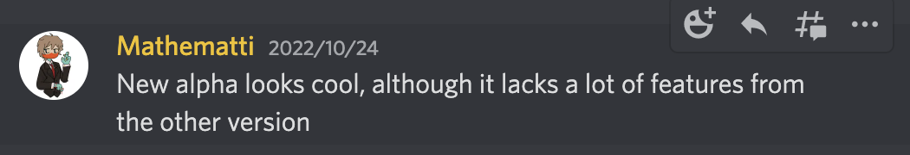

## Introduction
The Alpha version of AFFiNE has been live for two weeks now over on [https://pathfinder.affine.pro](https://pathfinder.affine.pro). During these two weeks, we have collected user feedback on several important features of the Alpha version, hoping to learn more about what users think and to guide our development of improvements and new features across future updates.

You may have also previously used, or even still use, the AFFiNE pre-alpha over on https://livedemo.affine.pro, we've kept this demo up as it shows some of the progress we made with our old-code base and what features will be coming in future releases. **Our plan now is to integrate all those features from the older demo, and more, into the latest AFFiNE release.** It's worth noting that we do not intend to release any more updates for the older demo, and it is only there for reference and a technology showcase.

Over these last few weeks, many users have also expressed to us their love for this version and their hopes for the future of AFFiNE. We are very happy that people like the Alpha version and take everyone's ideas very seriously. It's an honor for AFFiNE to have such a strong and active community, and for AFFiNE's value to be recognized by everyone.

## Dark Mode
Dark Mode is a brand-new feature. During the pre-Alpha stage, many users suggested to us that this feature should go live. So we added this feature to the Alpha version, hoping to give users a better visual experience.

**Ishaanrathod said:**

**Hioko said:**

**Enamul said:**

After the Dark mode feature went live, users loved the feature more as well. This makes us very excited, and we made the right decision in choosing to go live with Dark mode in the Alpha release.

**Edenilson LR said:**

**Mathematti said:**

## Shortcuts
In August, UlyssesZhan asked us if we could support shortcuts because he wanted to have a quick way to select specific content. We thought this was a basic feature that an editor should have and would enhance the user experience. So in the Alpha release, we have this feature live and expect that it will help users improve their editing efficiency.

**UlyssesZhan said:**

In mid-October, the Shortcuts feature of Alpha went live. Our Alpha release aims to provide a basic editable product for users, so basically, all shortcuts are for text content. We were also very fortunate to receive encouragement and love from everyone after the product went live, and this is what motivates us to strive for a better version.

**αβiδ said:**

## Markdown

Actually, the Alpha version is a brand new version for AFFiNE. Although it doesn't have more cool features than the pre-Alpha (live demo) version yet. It provides a greatly improved and stable editing environment for users, allowing for a more structured and cleaner approach to development and the support of more features in the future. It's a great start for both us and our users, and Markdown is the first feature to go live in the new version.

Markdown is one of the most popular suggestions from our users, 90% of them want to support Markdown in our editor.

**Jimmy W said:**

There is still a strong demand for Markdown from users, as it does provide us with convenience.

**Bryan said:**

We also conducted a user poll to find out how familiar users are with Markdown, and will soon publish a Markdown user guide to help you make the most out of the Markdown syntax and use it inside of the latest AFFiNE.

We really appreciate all of our users' suggestions and support! 

**Please feel free to contact us if you encounter any bugs or have some new feature ideas. Thank you sincerely for your support!**

- **Feedback:** https://github.com/toeverything/AFFiNE/issues/new/choose

- **AFFiNE Alpha:** https://pathfinder.affine.pro/
