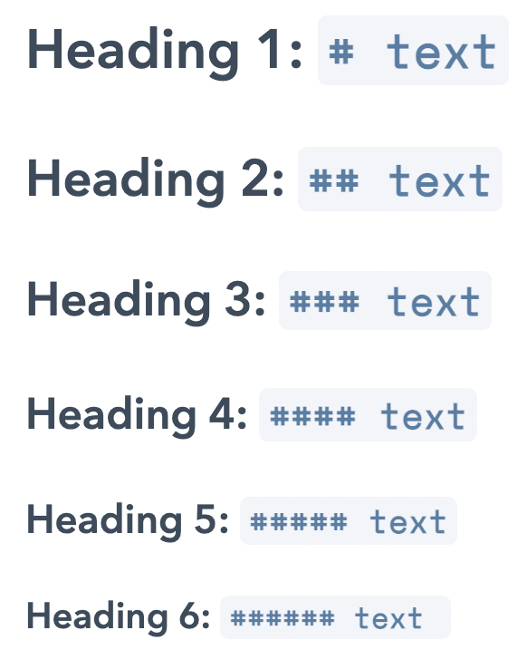
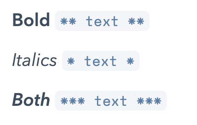
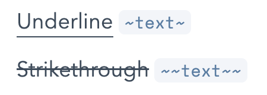
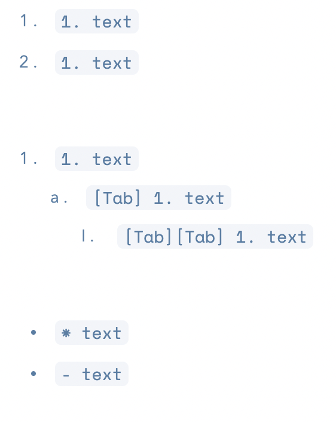
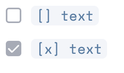
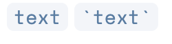
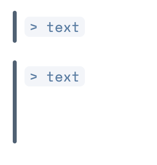

[AFFiNE Alpha](https://pathfinder.affine.pro) will be launched soon! Thank you very much for your continued interest and trust in the AFFiNE team.
Since the launch of AFFiNE pre-Alpha, we have received many private messages and emails from our users, and they have given us lots of feedback. We realised that there were still many problems with AFFiNE pre-Alpha, whether that was user experience, page stability, or something else. After considering many aspects, we decided to refactor AFFiNE - start again from the ground up and we are now excited to announce AFFiNE Alpha.

**Key words**：Markdown, Shortcuts, Syntax

Markdown is a lightweight and easy-to-use syntax for styling your writing. It includes features such as headings, lists, code blocks, and more. Markdown is designed to be easy to read and easy to write, and there is support across a wide range of applications and software. Here are some of the key features and benefits of Markdown: 
- Designed to be easy to use. 
- Easy to read and easy to write. 
- Great way to share your work with others. 
In fact, this article itself is written in Markdown!

### Headings
Generally used for titles, headings allow us to manage our documents effectively. They can help point to key and relevant information in the text. They also can be used to divide a document into logical sections and subsections. So how do we use headings in Markdown? Well, we just need to use the pound key/hash key and for each # we use we can create titles from H1 (heading 1) down to H6 (heading 6).

### Bold and Italics
Bold and italics are some of the most commonly applied styles to text. Generally bold is used for strong emphasis and italics weaker emphasis, so let's get started and apply them to our writing - this time we'll need the use of the asterisk, this little star-like character *. So just the one * for a little emphasis (italics) and ** for a stronger emphasis (bold). You could even try *** to apply both bold and italics.

### Underline and strikethrough
Some other common text effects include underlining and strikethrough of text. Often, most documents choose either italics or underlining to add the slight emphasis. As for strikehtough, maybe you'd like to show draft changes and text deletion. Both of these functions utilise the tilde key ~.

### Ordered and Unordered Lists
Lists are another great feature supported by Markdown. Lists allow us to emphasize important ideas, while also increasing the readability of text by simplifying long sentences or paragraphs and adding aesthetic space to make reading more pleasant. We'll need a few different keys depending on what type of list we'd like to create. 

An interesting thing about Markup is that we can use 1. in the Markdown syntax, but it will still render the correct ascending number in the list if there is no empty line. When using the tab key on the keyboard, you can indent the text and access sub-lists.

### Task Lists
How about a task list of to-do items? Maybe there's a task that needs to be accomplished or perhaps you are reviewing items in a meeting. There are lots of ways to utilise to-do items in your documents and workflow. Using square brackets, we can create these actions tasks and if we add an x inside it'll default to the ticked/selected state.

### Code Blocks
When writing documents, code blocks allow you to clearly separate code, that could be copied, pasted and run or used, from the rest of your text. Currently support is available for inline code blocks with code blocks (that span over several lines) coming in the near future.

### Links
Hyperlinks are all over the web and allow us to easily navigate without having to remember long URLs and typing them out. Within your documents you can easily link to other websites, maybe to link to more information, further reading or as a reference. You can set the URL you would like to be visited when clicked, and customise the text that is shown.

### Quotes
Another feature you might like are quotes. From reporting someone else's speech to emphasising a key idea/ opinion someone would like to get across. This function is flexible and a quote can take up just a single line or multiple lines.

### Export in Markdown
Once you've finished editing what can you do next? How about exporting your file using Markdown? 
Markdown has great support across many different services and products so we made sure that this is an option. Allowing you to save and export your files allows you to keep control of your data. 
 

### Try it out!
Hope you've found this guide about Markdown and available syntax useful. What better way to solidify this knowledge then to try it out yourself over on the live AFFiNE Alpha demo: [https://pathfinder.affine.pro](https://pathfinder.affine.pro) and let us know how it goes.
