2023 is coming soon! Good luck, good health, good cheer. AFFiNE wishes you a happy New Year！

Time passes! I can't believe that 2022 is over so soon. In 2022, AFFiNE is also growing fast and building strength to move forward. We are also continuously optimizing our products and hope to provide better products and services. Today, in this festive moment, AFFiNE brings you a little gift for the New Year. So please keep an eye out for it!


You've all used the rebuilt [AFFiNE Alpha](https://pathfinder.affine.pro/)! We've **added even more rich features to Alpha that we hope will help you create and manage your documents**! The first thing we can't wait to share with you is - we support editing multiple files. It can manage your personal file space on your current device or browser! Then we've got support for **formatting quick bars, quick studies, images, dividers and code blocks to make your editing experience easier and more beautiful.**


## Multi-Document Management
### Create & Favourite it
This is an fantastic feature compared to the previous version! **All page holds all the documents you have created**, and you can manage them here. Before you **manage these documents**, I will show you how to create a page. **In the bottom right-hand corner of this page, you will find the Create button; click on it to jump to a blank page and enter the name of your document to create it.**

**Note: The data in your document management space is currently stored in your browser. We will provide an accounting system to ensure the security of your data in the next version. To prevent the loss of your files, please be aware of where your files are stored when you use them! (Only the current device and browser are currently supported!)**

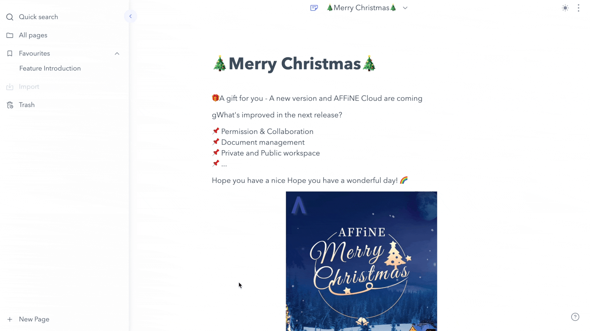

AFFiNE also provides a **Favorites workspace to put your important or frequently used files**. Of course, it is up to you to decide which files you want to move into this space. It is also straightforward to use. You **hover the file** you want to move into the Favorites space, and then an icon will appear after the title. **Click on the icon to see the file moved into the Favorites space.**

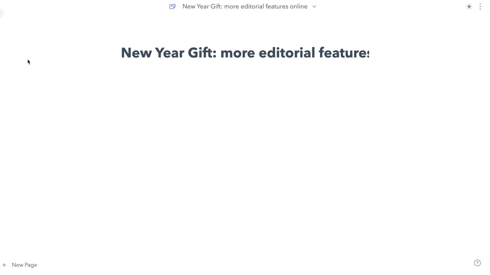

### Delete & restore it
If you want to **delete a document, open the `⋮` shortcut menu** in the document list, and **you can move the paper to the trash by clicking the 'Delete' button**. If you delete a file by mistake, don't worry. The files you delete are in the trash currently. **You can go to the trash and find the document you have deleted by mistake and restore it!**

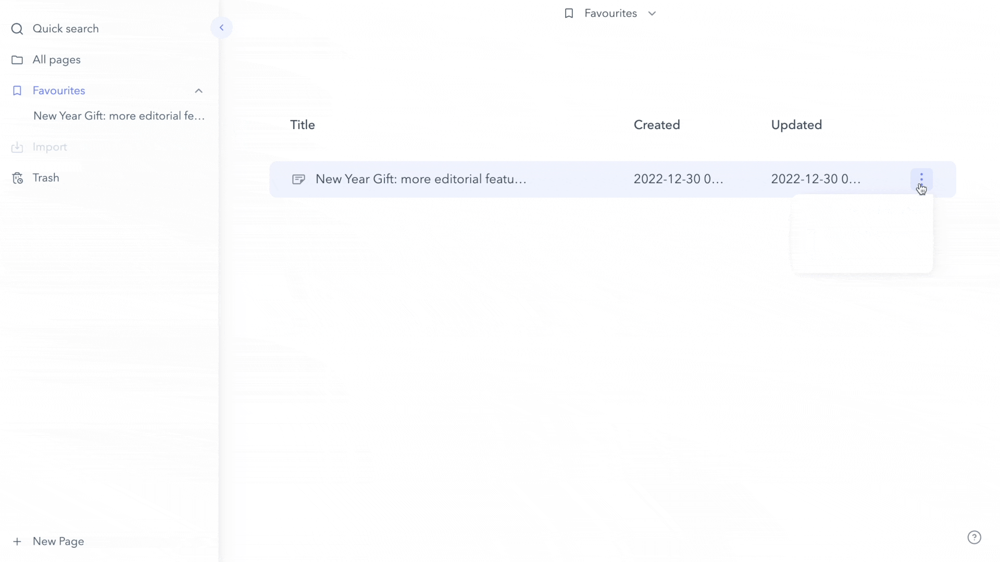

## Formatting Quickbar online! Content becomes artistic
Formatting Quickbar allows you to **create richer formatting more conveniently**. When formatting text, **the cursor will select the content to be formatted, and a function bar will appear above the paragraph**, allowing you to choose the function to suit your needs.

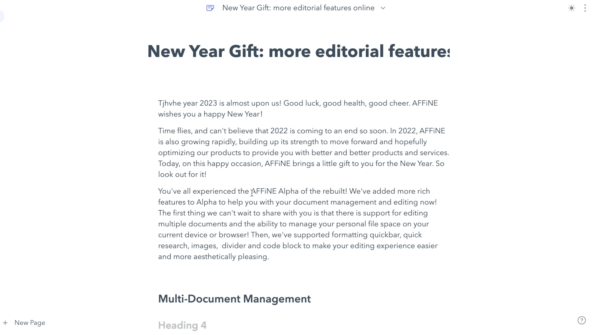

## More features to help with creativity
### Quick Search
In this version, we offer you a quick search function. You can see **the 'Quick search' button in the function list on the left**. When you use this function, **you enter a keyword in the search field, and AFFiNE will automatically search for the presence of that keyword in your article. The search results are then displayed in the list below.**

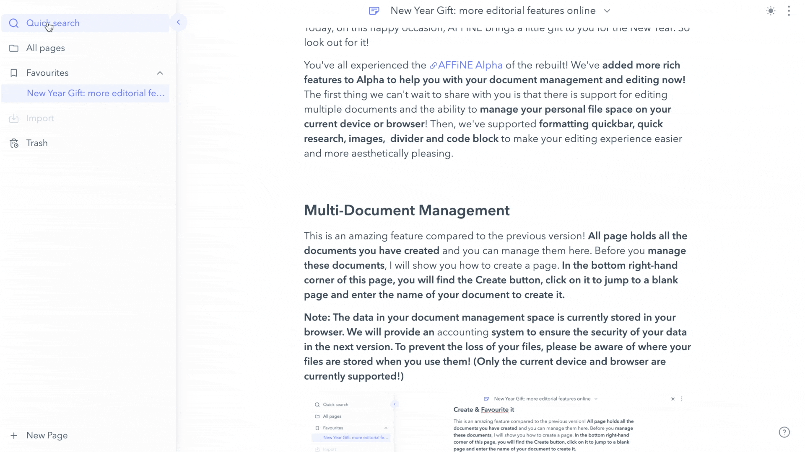

### Image
**You should note that AFFiNE currently only supports the use of copy & paste to insert images into documents. More convenient ways to add images will be refined in a later version.**

 As shown in the image, when you need to add an image to your article, just **copy the material you have prepared, and you're done**! Some images don't seem to be the right size when you paste them in. At this point, you **click on the image, and then an outer border will appear, drag and drop the frame with your mouse to resize the image at will. And when you hover over the image with your mouse, we provide you with several function buttons for adding captions, copying, downloading, and deleting**, which can also be convenient!

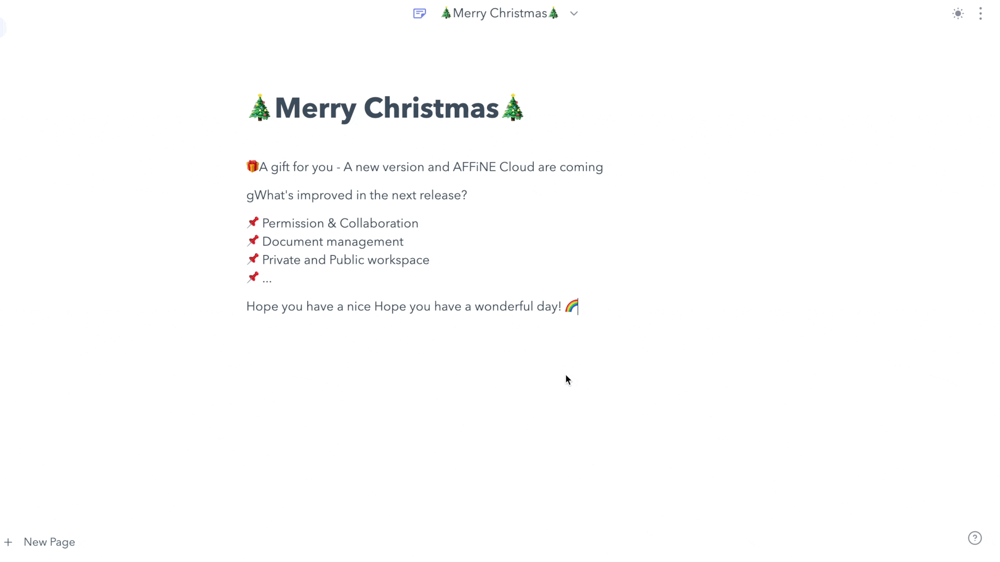

### Divider
The divider is a new feature that helps you format your documents to look more explicit and organized. **You can insert a divider directly using Markdown syntax; a space will call up the divider when you type `***` or `---`. And the divider format will be selected when you move the cursor using the keyboard up, down, left, and right keys after inserting the divider.**

**Note: The only way to insert a divider that is currently supported by AFFiNE is via Markdown syntax. The divider use button will be available in the next release.**

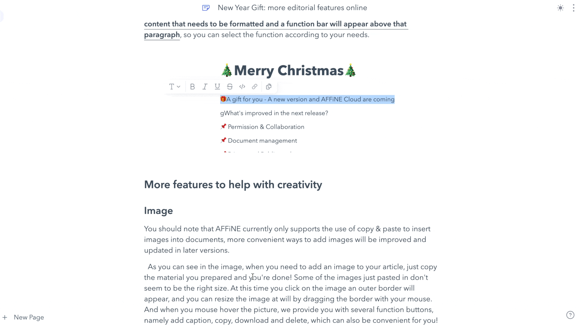

### Code block
In the previous version, AFFiNE only offered you the inline block. We have added the code block in this version, which allows you to present your code blocks in a more independent form in the text, as this display will **distinguish the different function statements with a highlighting style**! We offer you **three insertion methods: Markdown, Shortcut and function buttons**. Whichever insertion method you choose, you have more freedom of choice.

The Markdown syntax for inserting a code block is '``` + Space' and as you can see in the image, the block is successfully inserted! You are free to choose the language of your code, the mouse hover block will appear with the corresponding options. If I were inserting in JavaScript I would choose the 'JavaScript' option.

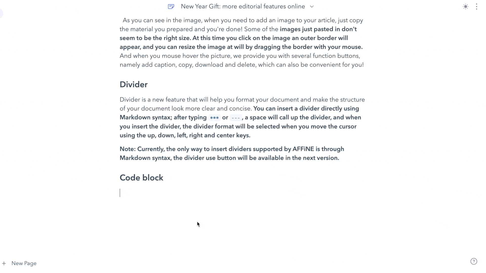

There are two other types of insertion that need to be introduced to you. **One is the function button insertion, which is applied by selecting 'Code Block' in the Formatting Quickbar. The other is via the Shortcut, which can be used by 'CMD + Option + C' for Mac users and 'Ctrl + Alt + C' for Windows users to wake up the code block style.**

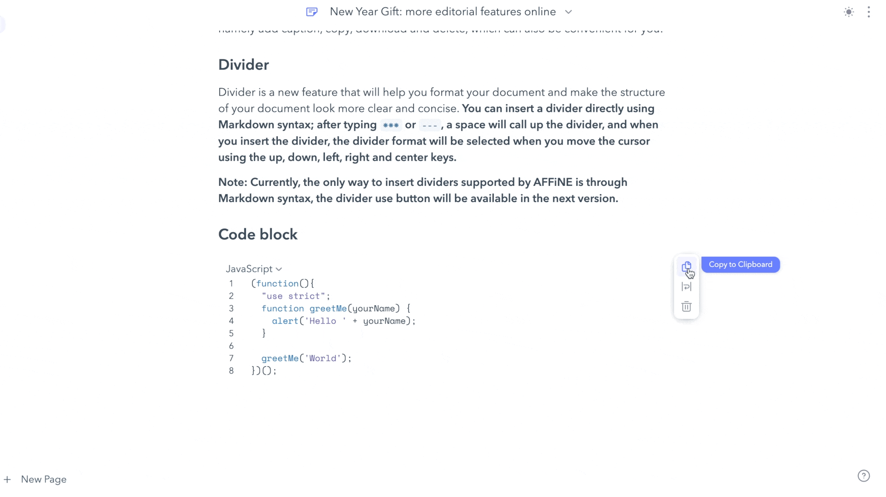

When you edit your code in a code block, you may be confused. How can I jump out of the code block style? Don't worry! We've set up a convenient way for you to switch! **All you need to do is enter your mouse twice, and the cursor will jump out of the code block style.**

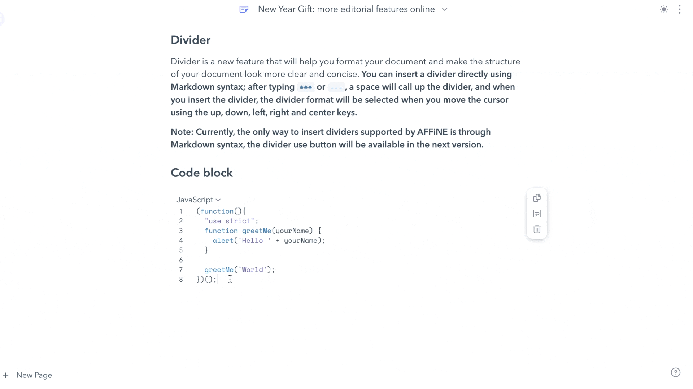

That's all the new features we've added in this released version! Thank you for your patience, and go to AFFiNE Alpha to refresh your memory! 😃

We have some more good news to share with you today 👏! **Our next release (AFFiNE Cloud) will be available to you soon**, and you'll be wondering what we'll be bringing online in the next release! **Sharing/collaboration/workspace management has been the focus of AFFiNE's recent developments**, so we hope to bring back the following features in the next version.

  - Permission and collaboration
  - Multi-terminal synchronization
  - Personal and public workspace
  - More ways to share pages 

If you would like to participate in the beta test or share your ideas about the AFFiNE cloud with us, head over to **[our community](https://community.affine.pro/c/build-in-public/) to discuss** the features of our new release. We have a dedicated 'Build in Public' channel to make our development progress available to the public! **Check out the Ambassador General channel for more information on how to get involved with Affine cloud!**

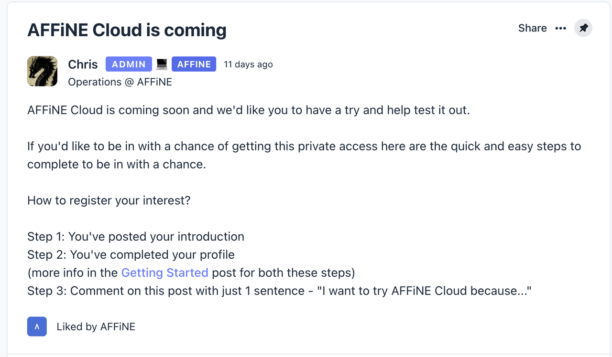

Finally, **next week we will release the current version of the Docker image to help you better localize your deployment and run AFFiNE**. Any questions, please feel free to contact us!

AFFiNE is always committed to helping and creating a thriving open-source ecosystem, and we welcome your continued suggestions and feedback.

So, may AFFiNE continue to be with you in 2023 as well.

HAPPY NEW YEAR, 2023！


Here are the official media accounts operated by AFFiNE, thank you for your interest! 

Please feel free to contact us if you have any questions. It'll be our honor! 

Hope you have a nice day!

- Discord: https://discord.gg/Arn7TqJBvG
- Telegram: https://t.me/affineworkos
- Twitter: https://twitter.com/AffineOfficial
- Reddit: https://www.reddit.com/r/Affine
- Medium: https://medium.com/@affineworkos
- GitHub: https://github.com/toeverything/AFFiNE
- AFFiNE Community: https://community.affine.pro/home

