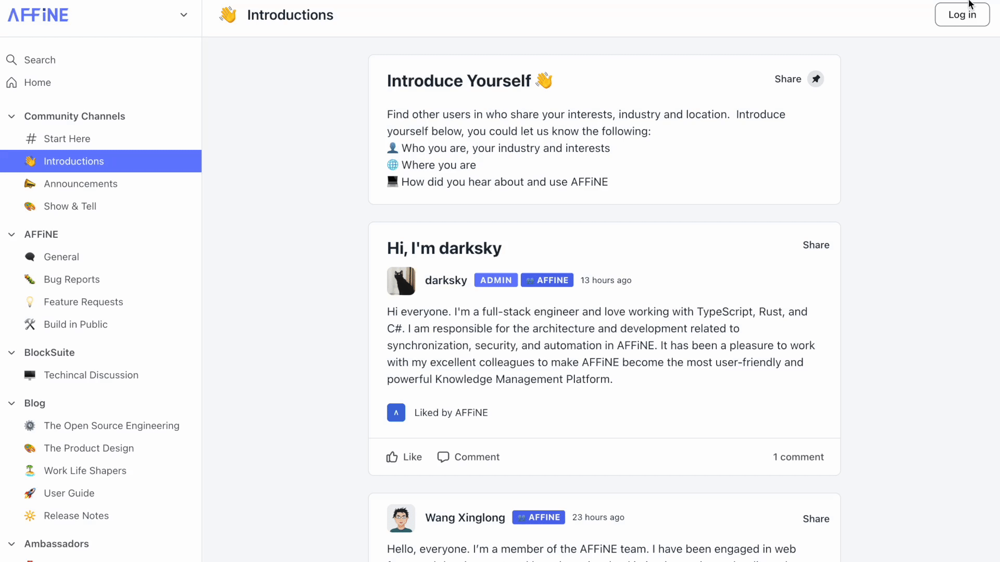

[AFFiNE's community](https://community.affine.pro/) site is already online! We welcome everyone to find and share noteworthy information! 

This is a place for AFFiNE lovers to focus. You can find all the news about AFFiNE and share what you want to say here. Next, I'll give a quick overview of how to use this community!

# Part 1: Why do we need the new community page?

First of all, our previous blog website did not have a comment section, so there was no way for people to communicate with us about the content of our articles. Now we have added **'like' and 'comment' functions to the community where you can post tips, ideas and suggestions**. We want to make the most of the value of our articles and really help people and solve problems.

Then, we collected **a lot of feedback and suggestions on Discord/Telegram previously**. For this information, we would like to have **a place to record it and provide a channel where people can communicate with each other**, and everyone can easily find it. The community uses a posts model so that anyone interested in the feature can post their thoughts at any time, and we can schedule subsequent features better (which would be more efficient than going through chat logs).

Finally, there are many content sites and feedback is scattered at the moment. So we hope we can have **a central place to sink our content**.

# Part 2: How do you join the community quickly?

## Sign up for an account

After entering the [AFFiNE community](https://community.affine.pro/) page, click on **'Sign up' in the top right corner** to register your account. If you already have an AFFiNE community account, you can simply click on 'Log in'.

Next, according to the tips of the registration table to obtain an account.

AFFiNE currently allows you to **sign in with your Google account**. You can click on 'Continue with Social Connection', then the page will jump to the account login window, next click on the 'Google' button to login. If you would like us to support more social logins, please do let us know in the community and submit your post. We'd love to hear from you!

AFFiNE currently allows you to **sign in with your Google account**. You can click on 'Continue with Social Connection', then the page will jump to the account login window, next click on the 'Google' button to login. If you would like us to support more social logins, please do let us know in the community and submit your post. We'd love to hear from you!

## Finding topics that you like

After **successful registration**, your website will be turned **to the main community page**. Next, you'll be able to find the content you're interested in here!

If you need to leave your own content in the community, **click on 'Start a post' to create a post**.

When you create a post, we provide you with some **text styles to make your post look better**. When you decide to send your post, you can click **'Select Space' to send it to a space that matches this post**. It will ensure that your post is seen by others who are interested in the topic.

**Friendly reminder: Different spaces correspond to different topics, you can read the pinned introduction post for each space to find the most appropriate space for your post.**

## Like & Comment

We offer you the 'like' and 'comment' functions. **If you find a topic in the community that you are interested in or want to participate in, come and join the discussion!**

# Part 3: Finding more...

## [Show yourself to everyone](https://community.affine.pro/c/introductions/)
We bring **AFFiNE lovers together here** to create a harmonious and healthy community environment. So **don't be shy, show your personality here**! We hope that you will find like-minded people here and that you will make progress together!

**Tips: We've prepared a reference template for you to introduce yourself, and would prefer to see more descriptions of your own hobbies/interests/pets/favorite foods, etc ~.**

## [Want to talk with other](https://community.affine.pro/messages/new)

We also offer you the ability to send private messages. If you want to find your friends to chat with, 'Direct Messages' is very handy for this purpose. **Click on the '+' icon in the top right corner of the pop-up box to create a chat window.**

Then the page **jumps to the dialog page**, enter the other **users' ID, edit the content you want to send**, click the send button and the other party will receive your message.

# [For AFFiNE Channel](https://community.affine.pro/s/affine/)

## [Bug Report](https://community.affine.pro/c/bug-reports/)

The AFFiNE channel offers you four spaces. If you find a problem in our application that needs to be solved, please submit your post in the **'Bug Reports'** space and **we will solve the problem for you as soon as possible**. (Please be sure to read the top introductory post for bug reports in detail. If you want to see other users' feedback on the issue, you can share the link of the Github issue to the community and express the importance of the bug to be fixed by the 'like' button)

## [Feature Request](https://community.affine.pro/c/feature-requests/)

If you **have some ideas for features you would like to tell us**, please submit your post in the 'Features Requests' space. We are aware that many users share interesting ideas for other productivity tools with us, and we would like to see more interaction between our team members and users here to address these interesting ideas. So we also welcome you to share interesting ideas for **new features you would like us to develop / you would like to discuss with others**. We would love to see a collision of interesting ideas here.

## [Build in public](https://community.affine.pro/c/build-in-public/)

We want to be as **open and transparent as possible in sharing our development process** with our users, which is a core value of the open-source community. Therefore, we will be posting our development process, as well as our development milestones here in the future. We hope to hear your expectations and suggestions for our phases in time.

We'll also be posting previews of major releases here, so stay tuned!

## [General](https://community.affine.pro/c/general-discussion/)

If you're **not sure where the content you're** posting belongs, **or want to discuss something that's hot right now** (like Web 3 or ChatGPT), feel free to post here and leave your wonderful inspiration/ideas and suggestions.

# [For BlockSuite](https://community.affine.pro/s/blocksuite/)

BlockSuite is **the plug-in system of AFFiNE and has been open-sourced for developers**. For programmers, they are free to combine these plugins to **create their own system**. If you are interested in AFFiNE BlockSuite, you can discuss it with us in this section.

# [For Blog Channel](https://community.affine.pro/s/blog/)

We use blogs as part of the content of the community and **allow users to participate in the discussion of topics**. We would love to see your feedback and comments on specific articles here, and feel free to contact us if you would like to see more relevant content in any area.

It is worth introducing, **"The Open Source Engineering"** which will introduce AFFiNE and BlockSuite technology selection and thinking about technology solutions; **"The Product Design"** which will share some of our product design team's experiences in the design field; **"Work Life Shapers"** which will share more of your -AFFiNE user stories; **"User Guide" and "Release Notes"** which are user manuals and update logs for each product. **"The User Guide" and "Release Notes"** are the user manuals and update logs that come with every product.

# [To be our ambassador](https://community.affine.pro/s/ambassadors/)

In order to **communicate the values of AFFiNE to as many people as possible**, so we are running an ambassador plan. If you are an AFFiNE lover, **welcome to join the ambassadorial group**. As an AFFiNE ambassador, we will give you priority access to new AFFiNE features. If you are interested in joining the ambassador group, **[you can find out how to apply here](https://community.affine.pro/c/start-here/affine-ambassador).**

# Quick Search

The Quick Search **filters out exactly what you want** and is a very useful function for users. Here we also provide you with this function. Input keywords to search for what you want quickly!

**Some final things to note:**

1. Our community page has just been set up, and we welcome suggestions for optimization in all areas;

2. Community does not currently support the upvote function, so for some of our subsites we use "like" to express approval;

3. If you would like to set up more new sites, please contact the AFFiNE operations team.

Thank you very much for your time. The above is an introduction to AFFiNE's new community site.

We are looking forward to seeing all the wonderful ideas that come together here and to seeing the growth of AFFiNE with you.
