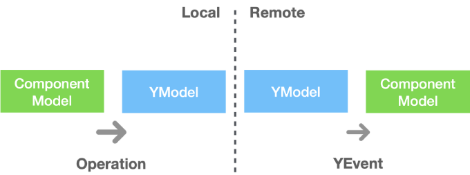
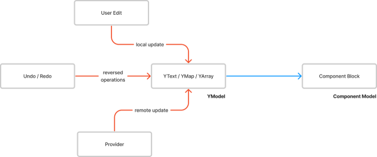

Traditionally, editors like Google Docs and Figma that support real-time multi-user collaboration have been considered “pearl on the crown” of web applications, which seem to require an advanced background in mathematics and algorithms to maintain. But are they really as difficult to understand as rocket science?

As a developer who has been working on web editors for several years, I recently redesigned a collaborative application framework called [BlockSuite](https://github.com/toeverything/blocksuite). As I evolved it, I became more convinced that **even collaborative editors that support complex conflict resolution mechanisms can be clearly understood and used as a general application architecture, so as to inspire (and even guide) the development of conventional web applications**. So I put together this article to explain how this system works, using the common operation of “pressing A on the keyboard” as an example.

We will explore the narrative from two different perspectives:
- From the **data model perspective**, we’ll explore how real-time collaboration techniques roughly modeling and updating their data structures, for basic operations such as inserting text. This will involve an introduction to the event sourcing design pattern, as well as a high-level overview of mainstream conflict resolution algorithms (ie OT and CRDT).
- From the **platform IO perspective**, we will introduce how a collaborative web editor should integrate important IO capabilities such as selection, keyboard binding and data persistence, behind seemingly simple keystrokes.

In this article we'll take a look the data model perspective, check out part 2 to learn more about the platform IO perspective. 

## Data model perspective

### Data driven update
If you’re just developing a simplest prototype, you just need to use the string to model state and call str.slice when pressing A. But that’s obviously not enough. In many editors I have maintained, what something that the designer will almost certainly do at some point, **is all about modeling the operation itself as a serializable data structure that is updated through a data-driven API**, rather than directly mutating the data model. This data structure is usually named operation, command or action, here we call it operation.

Operation-based updates API usually looks something like this:

```
// Text inserting is only one type of operations
interface InsertOperation {
  type: 'insert'
  i: number
  str: string // would be 'a' after you pressed a
}

type Operation =
  | InsertOperation
  | AppendOperation
  | DeleteOperation
  // ...

function commit(operation: Operation) {
  if (operation.type === 'insert') {
    // insert string...
  } else if (operation.type === 'append') {
    // append string...
  }
  // ...
}
```

Such API are essential for two points:
- After storing the user’s sequence of operations, we can get the necessary information for undoing and redoing - which of course can also be achieved by storing the full state after each operation as a deep copy, but trust me, almost no collaborative editor that cares about performance will do this.
- Modeling the operation itself as a serializable data structure means that we can distribute this data across the network, which is necessary for multiple people to collaborate in real time.

So far, the state management mechanism we’ve described is no more complex than Redux and is essentially a classic [event sourcing](https://martinfowler.com/eaaDev/EventSourcing.html) design pattern. Next we’ll describe what’s really interesting in the collaborative editor architecture, namely how to deal with the challenges of multiple concurrent updates.

### From single-player to multi-player
When multiple people collaborate, doc will inevitably have the possibility of conflict: what if two people enter uppercase A and lowercase A in the same position in the doc at the same time?

The good news is that the previous operation abstraction is still very applicable here. Assuming that each operation data carries the exact timestamp, the naive solution under ideal circumstances is to merge the operation from the remote, insert the operation sequentially, and reapply the affected operation sequence to form a git rebase-like effect.

Notice that there are two data structures, model and operation, around which you can design algorithms. This corresponds to the two current OT ([Operational Transformation](https://en.wikipedia.org/wiki/Operational_transformation)) and CRDT ([Conflict-free Replicated Data Type](https://en.wikipedia.org/wiki/Conflict-free_replicated_data_type)) routes for real-time collaboration:
- **OT is a transformation of the operation itself**. Suppose two conflicting operations A and B for the same state are received, the OT Algorithm can transform them into A‘ and B’, so that each client applies AB‘ and BA ‘ in different order to achieve consistent results. However, in order to determine whether to transform A or B for different clients, a central node that executes the transformation logic in authoritative chronological order needs to be introduced, which also means that it almost must be a centralized scheme.
- **CRDT is a data model**, which basically adds a logical timestamp to all data fields in the model. Its algorithm ensures that each client can get the same result no matter what timing it receives operations from others, which is known as [eventual consistency](https://en.wikipedia.org/wiki/Eventual_consistency). This means that in the above example, **it is not so important to consider whether you get A or a or Aa, it is important that everyone gets the same result**.

OT only transforms lightweight operation data, so intuitively it may have better performance than CRDT. But in fact, with the [breakthrough](https://josephg.com/blog/crdts-go-brrr/) of algorithm engineering, modern CRDT has achieved a performance level close to native sequence structure (not only that, if you continue reading this article, you will see more unique advantages of CRDT). In BlockSuite we use the CRDT library [Yjs](https://github.com/yjs/yjs), which we will discuss below as an example.

A CRDT library such as Yjs can encapsulate its API fairly close to native JavaScript string, which seems that you do not need to construct an operation data structure to use:

```
import * as Y from 'yjs'

// All collaborative states in app can be managed within a YDoc container.
// Network synchronization can be supported by connecting the instance to a provider that supports different protocols. such as WebSocket
const doc = new Y.Doc()

// Create a collaborative text object on a document
const yText = doc.getText('text')
yText.insert(0, 'hello world')
yText.delete(5, 6)
yText.toString() // 'hello'
```

But in fact, there will still be a data structure equivalent to operation behind the scent, which is called an [item](https://github.com/yjs/yjs/blob/main/src/structs/Item.js) in Yjs. And in addition to the [YText](https://docs.yjs.dev/api/shared-types/y.text) type for text editing, Yjs also provides basic data types such as  [YArray](https://docs.yjs.dev/api/shared-types/y.array) and [YMap](https://docs.yjs.dev/api/shared-types/y.map), which can even be nested within each other. But no matter it is YText, YArray or YMap, all the data in these objects are stored in a doubly linked list. Roughly speaking, **each item in this linked list uniquely records the data modified by one certain user operation**, which is similar to blockchain to some extent. It can be considered that the operation on YText in the above example will eventually be transformed into structural transformations such as append, insert, split, and merge on this linked list. Each item in this linked list will be distributed after being serialized, and based on the guarantee of the CRDT algorithm, **as long as each client can finally receive all items, no matter what order the client receives these items, they can reconstruct the completely consistent doc state**.

This means that after pressing A, an item will be created in Yjs and inserted into the linked list. In the classic CRDT implementation, each character will be modeled as such a separate item object. But Yjs has optimized this to combine consecutive input characters into the same item object, reducing memory consumption.

Since the intent of this article is not to delve into the design principles of Yjs, we will only cover the data structure of the collaborative editor here.

### Define data flow

The CRDT library has helped us doing the heavy lifting of conflict resolution, so that we don’t have to think about how to merge conflicting states when developing the editor. But when actually using CRDT in an editor, the way data is updated can still be quite different, and this part is worth clarifying.
Since CRDT libraries like Yjs have their own encapsulated model object instances, this means that even for a character like A, there will still be at least two copies of states containing it:
- The UI model instance used by the component, hereinafter referred to as the *component model*.
- A model instance in Yjs, hereinafter referred to as *YModel*.
For the synchronization of these two models, intuitively there are two possibilities:
- When the local user enters A, the component model is updated first, and then synchronized to YModel.
- When remote user input A is received, the YModel is updated first and then synchronized to the component model.

This actually forms a bidirectional dataflow:



Modeling local and remote state is easy, but it complicates the code by manually distinguishing between states like isRemote for every update. It also needs developers to carefully match `unobserve` and `observe` operations on YModel, so as not to create an infinite update loop (YModel update → component model update → YModel update…), like this:

```
let isRemoteUpdating = false

async function remoteObserver(events: YEvent[]) {
  isRemoteUpdating = true
  // update component model according to yjs events
  // ...
  isRemoteUpdating = false
}

function commit(operation: Operation) {
  if (isRemoteUpdating) return

  // ignore local YEvent to avoid infinite loop
  yStore.unobserveDeep(remoteObserver)

  // update YModel according to operations
  // ...

  yStore.observeDeep(remoteObserver)
}
```
Compared with bidirectional data flow, another more recommended mode is to use **unidirectional data flow**, that is, always use YModel as single source of truth , listening for its state changes ([code](https://github.com/toeverything/blocksuite/blob/0f4885790f06bc7fec334e6fc3e0483a451b82f6/packages/store/src/space.ts#L102)). This means that YModel should also be changed first rather than component model when updating locally, so that the YModel → component model cycle are always happened in the same event callback, regardless of whether updates occur locally or remotely. This forms simpler and more stable architecture:



When implementing undo and redo, the mental model of one-way data flow is also very suitable. For example, Yjs provides [Y. UndoManager](https://docs.yjs.dev/api/undo-manager) for out-of-the-box history state management. This tool works conceptually by applying the inverse of operation (or item) to the YModel. This also triggers an update to the YModel, just like an edit from remote, and the corresponding event can be handled in the same event callback.

It is worth noting that the history state management capabilities of the CRDT are already built on the operation mechanism, which means that its users do not need to re-implement an event sourcing mechanism themselves to support stable undo redo, or so-called “time travel”. That’s what BlockSuite is also doing ([code](https://github.com/toeverything/blocksuite/blob/0f4885790f06bc7fec334e6fc3e0483a451b82f6/packages/store/src/space.ts#L104)).

## Summary
At the data model level, data-driven updates occur after pressing A, such as inserting a new item into the CRDT data structure.

As an example, BlockSuite may be the first open source collaboration framework that uses CRDT as a first-class citizen data model, but it is still evolving rapidly. We are continually improving it with and for [AFFiNE](https://github.com/toeverything/affine) knowledge base. Keep following for the next article on the Platform IO perspective.


