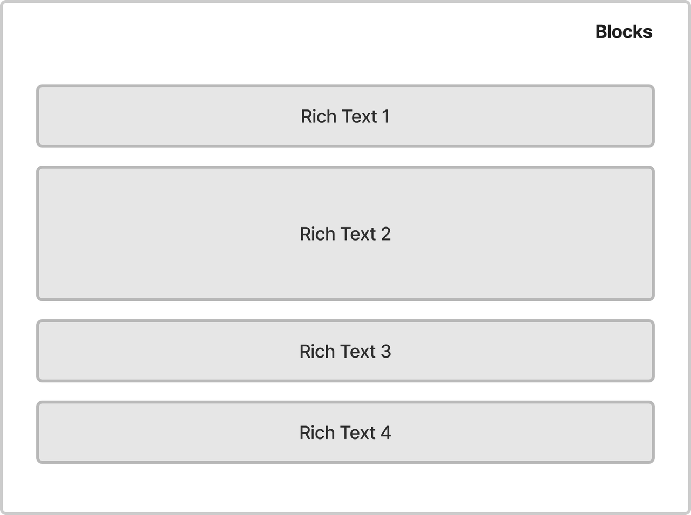
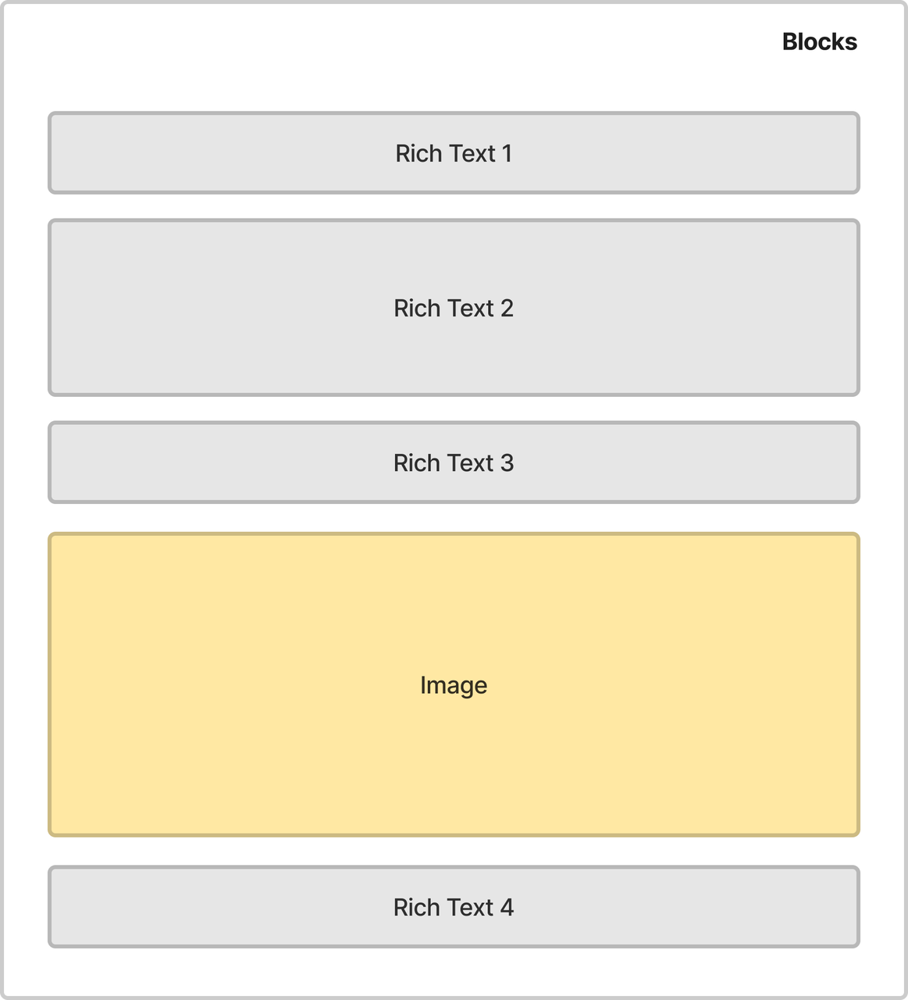
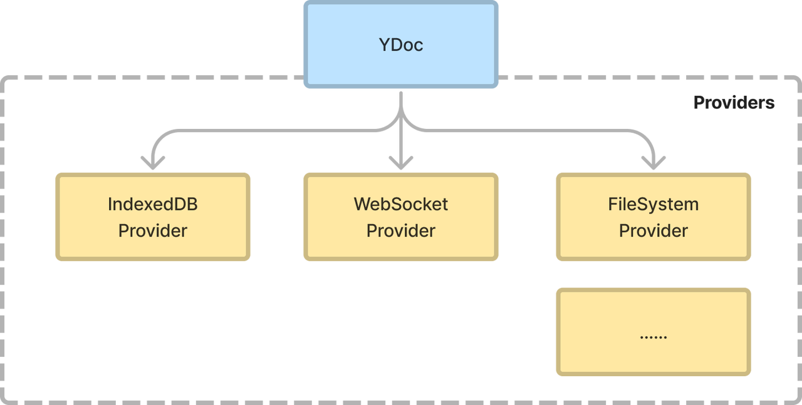

Real-time multi-user collaboration tools can seem complex with advanced mathematics and algorithms to maintain. But how difficult are they to really understand? In the previous article we focussed on the data model perspective along with the modeling and updating of data structures for basic operations such as inserting text. With the introduction of an event sourcing design pattern, and high-level overview of mainstream conflict resolution algorithms (ie OT and CRDT).

Today's article will focus on the platform IO perspective, introducing how a collaborative web editor should integrate important IO capabilities such as selection, keyboard binding and data persistence, all behind seemingly simple keystrokes.

## Platform IO perspective

The data model is at the heart of the collaborative editor, but there are many specific web platform APIs involved in making an application work. Here are a few examples in real-world scenarios to help understand.

### Press A at the end of doc

In this simplest scenario, we need to at least consider whether the new A has styles such as bold, italic, and underline. This part of the work falls under the scope of classic rich text editor. As a lightweight web editor, BlockSuite also uses [contenteditable](https://developer.mozilla.org/en-US/docs/Web/HTML/Global_attributes/contenteditable) for edibility. It supports using Yjs’ [YDoc](https://docs.yjs.dev/api/y.doc) to build a tree doc structure, where each paragraph will be modeled as a nested block, each paragraph block has a separate instance of YText, **and the new A will be added to the end of the YText of the last block**. Everything seems pretty simple here.

But note that in modern editors, text DOM updates need to be obtained through [MutationObserver](https://developer.mozilla.org/en-US/docs/Web/API/MutationObserver). When getting the notification from MutationObserver, DOM has already been updated - which means that you can only manually distinguish whether the update is from local or remote ([code](https://github.com/toeverything/blocksuite/blob/0f4885790f/packages/store/src/text-adapter.ts#L312)), which is equivalent to falling back to a bidirectional data stream. Fortunately, for each rich text paragraph block, BlockSuite individually encapsulates the binding to the corresponding YText ([code](https://github.com/toeverything/blocksuite/blob/0f4885790f/packages/blocks/src/__internal__/rich-text/rich-text.ts#L70)), making this part of the logic almost transparent in actual use. For all other general model fields, the one-way data flow mechanism described earlier applies in BlockSuite.

### Press A after range text selections

If you press A after selecting several pieces of text, then the expected behavior is to insert the new A after deleting the selected text. But in order to use the browser’s native blue highlight (ie range selection), you need to consider whether to introduce more control yourself:
- First of all, in the keyboard event callback of pressing A, we can use the [getSelection](https://developer.mozilla.org/en-US/docs/Web/API/Window/getSelection) API to know whether a character is currently in the range selected state. At this time, the developer needs to consider whether to use the browser’s default behavior. If you use the browser’s native behavior, then we can rely entirely on the browser for the new state, and the implementation will be very simple. But as the cost, if there are complex custom UI components in the editor, their DOM could be easily broken by the browser’s default behavior when partially selected.
- If you choose to preventDefault, then you need to obtain the [range](https://developer.mozilla.org/en-US/docs/Web/API/Range) affecting the model ([code](https://github.com/toeverything/blocksuite/blob/0f4885790f/packages/blocks/src/page-block/utils/container-operations.ts#L138-L139)) by the selection state, and to complete the update operation of the model by yourself, such as deleting the right half selected part or replacing the whole content. At this time, the update mechanism is closer to the concept of [controlled component](https://reactjs.org/docs/forms.html#controlled-components).
Traditionally, to simplify selection management at this point, many editors have kept the entire doc in a single contenteditable container. But in such a monolithic container, some restrictions on UI components have to be introduced. Instead, BlockSuite implements a design that takes into account both stability and extensibility:
- Split the doc into paragraphs, each paragraph corresponds to a separate contenteditable container and a separate YText instance. Each contenteditable container is encapsulated as a RichText component, which also only supports rendering and editing plain text.
- For block-level elements and container elements such as images and groups, they are implemented as WebComponents and are not inserted into contenteditable. Since WebComponent instances are standard DOM instances, this makes it easy for the native DOM selection API to know whether such a WebComponent component is selected and handles its own updates.

Based on this design, each RichText component can use a simple and stable sequence data structure, while supporting complex nested editable UI. Currently, BlockSuite temporarily uses Quill to implement RichText components, but the history tracking feature of each [Quill](https://quilljs.com/) instance is not used, and their state is bound to YText. This makes BlockSuite effectively equivalent to an “editor that manages multiple RichText editors”, which can schedule and update the status of multiple paragraphs by itself after pressing A with range text selection. And even if there are non-text elements in the native selection, it can be handled efficiently.

### Press and hold command and press A
Sometimes, receiving a keystroke does not mean that the data model should be updated, such as the common select all operation after triggering command + A. In this case, the doc UI will generally be refreshed, but the model field will not be updated or deleted. Above we have already mentioned browser native selection, but in addition to this, as a popular approach in modern collaborative editor products, the custom selection UI is also common, for example:

Such a custom selection state can often coexist with native selection, depending on the product design. But there is also a pattern problem when implementing custom selection: if there are N kinds of blocks, how to manage their custom highlight state?

A general idea is to add a state like isSelected: boolean to each block’s UI component, but this is intrusive and makes it difficult for third-party components to be used directly in the editor. Instead, BlockSuite models this kind of selection as absolutely positioned singleton ([code](https://github.com/toeverything/blocksuite/blob/0f4885790f/packages/blocks/src/page-block/default/default-page-block.ts#L71-L95)). When updating a custom selection, all that happens is always a set of rectangles DOM positioning to different selected elements, which is equivalent to lifting up the management of the selected state to the global level. This design pattern is potentially applicable in a variety of editor products, as these states almost always exist as HUD overlay, so this kind of modeling allows block nodes to just focus more on rendering the content itself.

### Press A when offline
In each of the above examples, we paid little attention on collaboration. This actually works as expected, since in this case the collaboration logic is already encapsulated when designing the data layer. This means that you can also use the mental model of a regular application when developing a collaborative editor.

This effect can also be seen when dealing with offline editing. If you already understand how CRDT works, you will find that CRDT-based collaborative editors have built-in support for offline editing from the very beginning: **All local model changes are applied directly to the YModel synchronously, even regardless of network requests.**

However, the update of YModel API is synchronous, but the network transmission is asynchronous. How is the gap being filled here? The concept of [provider](https://docs.yjs.dev/tutorials/creating-a-custom-provider) is required here. The YDoc can be serialized into binary incremental update data using the [y-protocols](https://github.com/yjs/y-protocols) format, and the provider is responsible for distributing or storing these Yjs doc updates. There are two types of providers, one is the database provider responsible for data persistence (such as IndexedDBProvider or SQLiteProvider), and the other is the network provider responsible for syncing over network protocols (such as WebSocketProvider or WebRTCProvider). A doc can connect to multiple providers, so that when any provider receives a data update, it will trigger the update and distribute the updated data through all other providers.

The state of the YDoc instance is still available locally when the doc is not connected to any provider. As long as the provider is connected, the doc data is smoothly synchronized and conflicts are automatically resolved. This is actually quite a powerful technical breakthrough, see the discussion of [local-first](https://www.inkandswitch.com/local-first/static/local-first.pdf) applications for more information.

## Summary
Over these two articles we can highly summarize the levels and perspective as follows:
- At the data model level, data-driven updates occur after pressing A, such as inserting a new item into the CRDT data structure.
- At the platform IO level, pressing A will behave quite differently depending on the current UI state. The less you rely on browser native behavior, the more control you have, but it also means more code implementation and more testing.
As an example, BlockSuite may be the first open source collaboration framework that uses CRDT as a first-class citizen data model, but it is still evolving rapidly. We are continually improving it with [AFFiNE](https://github.com/toeverything/affine) knowledge base, and invite you to join us on our journey and stay up-t-date with our developments.