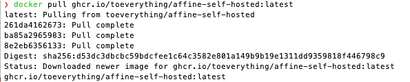

Hello everyone! We've updated the Pre-Alpha and Alpha Docker images with both local-storage and server-side support. As we are privacy focussed and local-first you will always have the choice of how you wish to use and store your data, so that's why we have provided Docker images for these different preferences.

Does that sound exciting to you 😃? Let us explore your options through this article and we'll guide you through the process.

**Tips:** The GitHub link for AFFiNE is https://github.com/toeverything/AFFiNE

## How to use it?

**Step 1:** You can find the **[Docker address(affine-self-hosted)](https://github.com/toeverything/AFFiNE/pkgs/container/affine-self-hosted)** from the affine package on GitHub. Here we provide you with both the Pre-Alpha and Alpha(live demo and pathfinder) of Docker support interface.


Once you have understood the above information, I will then show you how to configure Docker. All you need to do is **run the command line code shown below** from your terminal.

```
docker pull ghcr.io/toeverything/affine-static:[pre-alpha-server]/[alpha-server]
```

You'll receive a similar message, which indicates that **the latest Docker image** has been downloaded.



**Step 2:** After successfully updating the Docker image, we are now **ready to run the `docker run` command.**

```
docker run -it --rm -p 3000:3000 YOUR_PATH:/app/data ghcr.io/toeverything/affine-static:[pre-alpha-server/alpha-server]

// docker run -it --rm -p [YOUR_PORT]:3000 [YOUR_PATH]:/app/data [image id]
```

**Notes:**
The command should take the following format `docker run -it --rm -p -v [YOUR_PATH]:/app/data [YOUR_PORT]:3000 [image id]`, where the **image id should be the same as in the first step. You can set `[YOUR_PATH]` to store the data on your host machine**, outside of the Docker environment（Remember to replace `[YOUR_PATH]` with the real path on your local device.).

If there are no issues, your AFFiNE deployment should be up and running. You'll receive a similar response as below.


**Step 3:** Head over to **your browser and visit localhost:`[YOUR_PORT]`** (if you are deploying locally, you'll need to enter the IP address if you've deployed it onto a remote server).


## What is Docker?
In this update, we provide you with **a Docker container to localise your data management**. So what is Docker? Docker is a lightweight virtualisation platform implemented on the Linux kernel. It **helps you to unify your system environment and allows you to run AFFiNE images on different operating systems**.
Once the Docker image is live, your local (self-hosted) version of AFFiNE will **automatically sync the data to the server and store it in the /app/data directory in the Docker container(You can customise your local storage path)**. You can edit offline on AFFiNE and this data will be stored in your browser. When you are online again, AFFiNE will automatically connect with your server and synchronise the data.


## Q&A Session
Below we've compiled some of the most frequently asked questions regarding our Docker releases.

### Q) Can we use server-side storage?
A) With this release, you can now take advantage of Docker volumes and store your data on the server-side and local.

### Q) Where did Sync-to-Disk go?
A) This feature proved to be difficult to use. We now use another technology which offers use a more streamlined and user-friendly experience.

### Q) Can I collaborate with others?
A) Yes, this version now supports live collaboration - though bear in mind the link sharing feature is not implemented.

### Q) Why Docker?
A) Docker offers a more simplified deployment experience to just get started. And as our code is available on GitHub, you are welcome to deploy from our codebase.

### Q) Is offline editing supported?
A) No, unfortunately we do not fully support offline editing in this version. In the future, we will use IndexedDB for offline data storage, and envision a seamless offline storage and syncing feature that we hope aim to be making available soon. 
* Due to a bug, the current version only supports offline editing if the user opens AFFiNE while connected to the internet and does not leave/close the page. Once the connection is reestablished, the offline data would then be automatically synchronized to the server. 

### Q) Can I use SSL and my own domain?
A) Yes you can, we don't currently have any step-by-step guide but welcome our community to contribute one. 


If you have any ideas you would like to share with us, please feel free to post them in the comments of [our community](https://community.affine.pro/home). We'll get back to you as soon as we can!