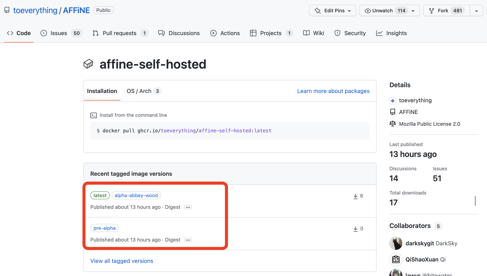
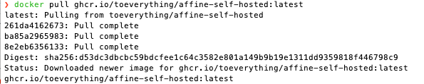
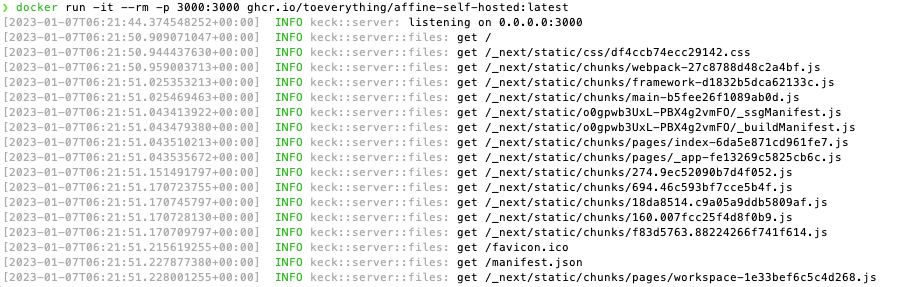
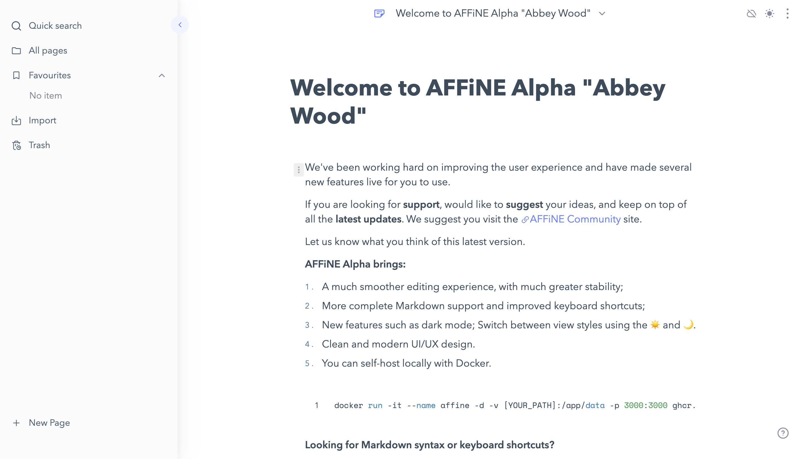
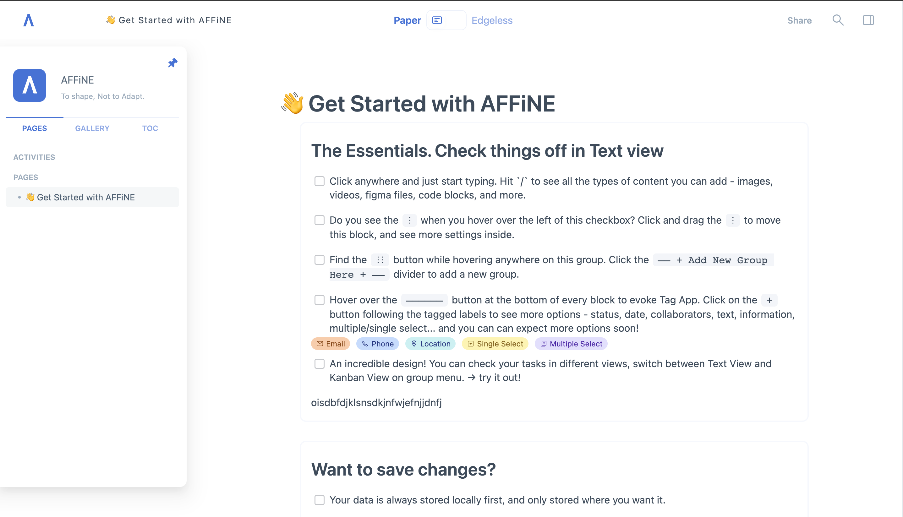

## Pre-Alpha and Alpha Local Setup User Guide

Hello everyone! We've recently updated our Docker images, and this guide will help you to understand the different versions available and how to deploy them. The main reason we offer these images, is as we are privacy focussed and local-first, you will always have the choice of how you wish to use and store your data, so you can choose how you want to use AFFiNE.

Currently, we provide both the Pre-Alpha and Alpha versions for your deployment. **Pre-Alpha is an older version, which is no longer maintained but still contains a variety of rich features**. We plan to retire this version completely in the future when the Alpha version is able to reach a similar feature list.

Does that sound exciting to you 😃? Let us explore your options through this article and we'll guide you through the process.

**Tips: The GitHub link for AFFiNE is https://github.com/toeverything/AFFiNE**

## How to use it?

**Step 1:** You can find the **[Docker address(affine-self-hosted)](https://github.com/toeverything/AFFiNE/pkgs/container/affine-self-hosted)** from the AFFiNE package on GitHub. Here we provide you with both the Pre-Alpha(https://livedemo.affine.pro/) and Alpha: "Abbey Wood"(https://pathfinder.affine.pro/) of the Docker support interface.



Once you have chosen your version, you are then ready to begin to configure Docker. All you need to do is **run the command line code shown below** from your terminal.

**Please note:** If you want the Pre-Alpha version, then swap out the `latest` tag for `pre-alpha` for all the following commands.

```
docker pull ghcr.io/toeverything/affine-self-hosted:latest
```

You'll receive a similar message, which indicates that **the latest Docker image** has been downloaded.



**Step 2:** After successfully updating the Docker image, we are now **ready to run the `docker run` command.**

```
docker run -it --name affine -d -v YOUR_PATH:/app/data -p 3000:3000 ghcr.io/toeverything/affine-self-hosted:latest
```

**Notes:**
The command takes the following format: 
```
docker run -it --name affine -d -v [YOUR_PATH]:/app/data -p [YOUR_PORT]:3000 [image id]
```

**Tips:**

- The `--name` flag makes it convenient for using and interacting with your Docker container - such as `docker restart affine`.
- The `-v` flag is optional but allows you to mount your data outside of Docker to your local machine. Remember to set `YOUR_PATH` to the directory of your choice.
- The `-p` flag allows you to set the port for where AFFiNE is running and listening, we use the default 3000 if you need to change this only change the first number e.g. `[YOUR_PORT]:3000`
- Finally, the `image id` is the version of AFFiNE you wish to deploy. Following this guide, it would be the same as the previous step - so `ghcr.io/toeverything/affine-self-hosted:latest`

If there are no issues, your AFFiNE deployment should be up and running. You'll receive a similar response as below.



**Step 3:** Head over to **your browser and visit localhost:`[YOUR_PORT]`** (if you are deploying locally, you'll need to enter the IP address if you've deployed it onto a remote server).



**Note: The above is an example of the Alpha: "Abbey Wood" version. If you need the Pre-Alpha version, just change Docker Image to the Pre-Alpha path!**



## What is Docker?
In this update, we provide you with **a Docker container to localise your data management**. So what is Docker? Docker is a lightweight virtualisation platform implemented on the Linux kernel. It **helps you to unify your system environment and allows you to run AFFiNE images on different operating systems**.
Once the Docker image is live, your local (self-hosted) version of AFFiNE will **automatically sync the data to the server and store it in the /app/data directory in the Docker container(You can customise your local storage path)**. You can edit offline on AFFiNE and this data will be stored in your browser. When you are online again, AFFiNE will automatically connect with your server and synchronise the data.


## Q&A Session
Below we've compiled some of the most frequently asked questions regarding our Docker releases.

### Q) Can we use server-side storage?
A) With this release, you can now take advantage of Docker volumes and store your data on the server-side and local.

### Q) Where did Sync-to-Disk go?
A) This feature proved to be difficult to use. We now use another technology which offers use a more streamlined and user-friendly experience.

### Q) Can I collaborate with others?
A) Yes, this version now supports live collaboration - though bear in mind the link sharing feature is not implemented.

### Q) Why Docker?
A) Docker offers a more simplified deployment experience to just get started. And as our code is available on GitHub, you are welcome to deploy from our codebase.

### Q) Is offline editing supported?
A) Due to browser limitations, we currently only support offline access on sites that have https deployed. We've begun implementing PWA support, but it's currently limited. We are grateful for the community contributions so far, and welcome further contributions on GitHub. So, for now, you can open and run AFFiNE, creating new pages, but currently, documents and workspaces are not available offline, so you would not be able to load server-side data.

We are working hard on providing greater client support to provide higher performance and a better offline editing experience.

### Q) Can I use SSL and my own domain?
A) Yes you can, we don't currently have any step-by-step guide but welcome our community to contribute one. 

>You may want to try something like [[caddy]](https://caddyserver.com/) to automate https support. For a tutorial on how to configure it, you may refer to the [caddy guidance](https://caddyserver.com/docs/quick-starts/https) document.


If you have any ideas you would like to share with us, please feel free to post them in the comments of [our community](https://community.affine.pro/home). We'll get back to you as soon as we can!