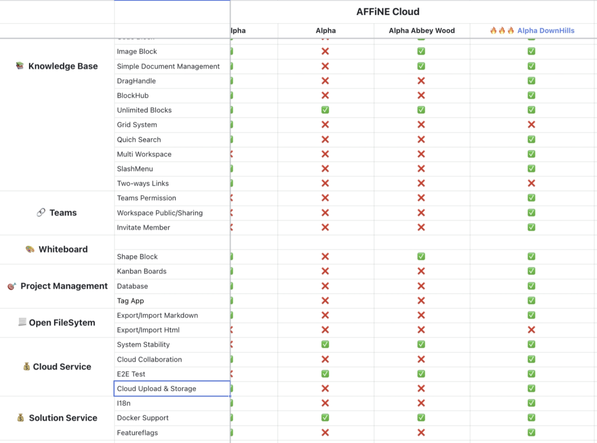
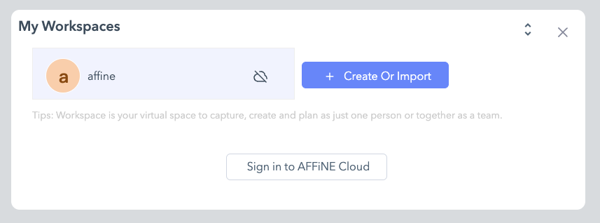
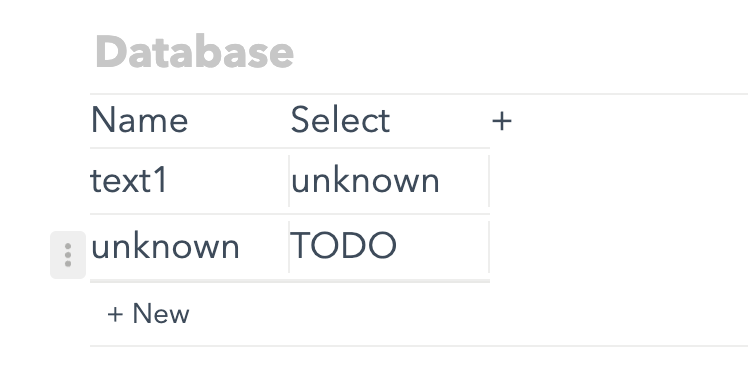
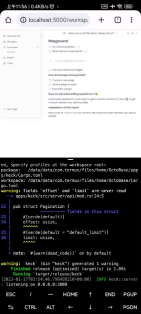

The Lunar New Year is a time of celebration and tradition, and as we prepare to welcome in the new year, we wanted to take a moment to update our community on our plans for the holiday.

One of the most important aspects of the Lunar New Year is spending time with family and friends. As a team, we value the importance of this time and will be taking some time off to celebrate with our loved ones. This means that during the holiday, our development work may slow down and there may be less activity on social media.

However, we want to assure our community that this time away will not impact our plans for future updates and development. In fact, **we have a big update planned for you all once we return from the holiday**. We will be working hard to make sure that it is ready for you as soon as possible.

We understand that this may cause some inconvenience, but we hope that you will understand and support our decision to take time to celebrate with our families. The Lunar New Year is a time to reflect on the past year and look forward to the new one, and we believe that taking this time to recharge and celebrate is essential for our team's well-being and productivity.

We wish you all a happy and safe Lunar New Year. We look forward to sharing our update with you soon.

## What can you look forward to?

We are super excited to announce a wide range of features that will take your experience with AFFiNE to the next level. Whether you're looking for **improved efficiency or enhanced functionality**, we've got you covered. Stay tuned for more information about these exciting developments.

The best place to get the latest information and sneak previews is on our community site. We have a specific space available for [Build in Public](https://community.affine.pro/c/build-in-public/) - where we highlight some key developments and various new interesting features.

### Feature list

If you are looking for a quick overview of what's coming up this graphic may be what you are looking for. There are a wide-range of updates - from **quality of life changes to new feature implementations**. In fact, with these latest updates, the newest Alpha version will surpass the Pre-Alpha in several aspects, and nearly completely encompasses all functionality from the older version.

**Some highlights include:**
- improved image block support
- drag and drop handles for easily organising your blocks
- BlockHub to find and utillise all block types to help empower your docs
- improved global quick search funtionality
- multi-language support and translations
- and much much more...

### Multi-doc Workspaces

The AFFiNE pre-alpha was a single-doc application for some time as we focussd on some core features and functionality. In the last release, Abbey Wood, we implemented multi-doc support which was a hugely requested feature that many of our users were waiting for. This next release will take things one step further, adding workspaces. Users will be able to create multiple workspaces, each hosting multiple docs. These workspaces will come with permissions that allow you to invite team members and other users to view/edit your docs. Collaboration is a key feature and this will be realised with our multiplayer support.

### Database Blocks

While it might look like a simple table, database blocks are coming which will open up a wide range of possibilities. More powerful than a table these blocks will continue to grow in importance as more features and supporting blocks are added. Storing your data inside database blocks gives you flexibility to be able to easily convert and transform your data. In the short term, that might just be a Kanban, but what about a wider range of charts and more powerful analytics.

This feature was previously featured in the AFFiNE Community's Build In Public space: https://community.affine.pro/c/build-in-public/database-block-is-coming

### Mobile Support

Have you tried opening AFFiNE on your mobile? You'll be greeted with a warning message encouraging you to use your desktop browser. But this will change! As we continue to improve the user interface and add more reactive elements your experience of using AFFiNE across different devices will continue to improve, but we aren't stopping there. For such a software as AFFiNE, we understand that good mobile support is not enough, it should be great. Too many mobile apps fall short of what's required or are extremely hard/buggy to use. That's why we are looking at developing and offering native support for mobile. Recent tests even had AFFiNE server components running on Android mobile. Imagine having a self-hosted, local-first AFFiNE deployment on your mobile device - working both online and offline.

This feature was previously featured in the AFFiNE Community's Build In Public space: https://community.affine.pro/c/build-in-public/experimental-attempt-running-our-sync-server-on-android

### Have a try

For AFFiNE we have recently updated the Docker images:
- You can find the packages directly on our GitHub: https://github.com/toeverything/AFFiNE/pkgs/container/affine-self-hosted
- And here is a user guide discussing the Docker deployment: https://community.affine.pro/c/user-guide/self-host-affine-with-docker-pre-alpha-and-alpha-local-setup-user-guide

If you'd like to have a try of some of these newer features that are yet to be released and get a technical preview of what's to come, we invite you to check out BlockSuite - the open-source collaborative editor project that powers AFFiNE. You can check out their GitHub: https://github.com/toeverything/blocksuite and deploy your own playground or directly play with the live demo deployment. There's also a newer unlisted demo that features the Block Hub enhancement:  https://blocksuite-git-fork-thorseraq-0111-feat-blockhub-toeverything.vercel.app/?init (please note this is a temporary link and will not work in the future, the GitHub page would have the latest available and working demo).

## Conclusion

So, whether you celebrate the Lunar New Year and/or the calendar New Year - Happy New Year to you! A new year marks a new milestone for AFFiNE as we continue to develop new features and improve on existing ones. We look forward to continuing the journey with you through next year and we continue to value your opinions and feedback.

As usual don't be afraid to reach out with any ideas, opinions, features, bugs, feedback or anything else...

- AFFiNE Community: https://community.affine.pro/home
- GitHub: https://github.com/toeverything/AFFiNE
- Discord: https://discord.gg/Arn7TqJBvG
- Telegram: https://t.me/affineworkos
- Twitter: https://twitter.com/AffineOfficial
- Reddit: https://www.reddit.com/r/Affine
- Medium: https://medium.com/@affineworkos