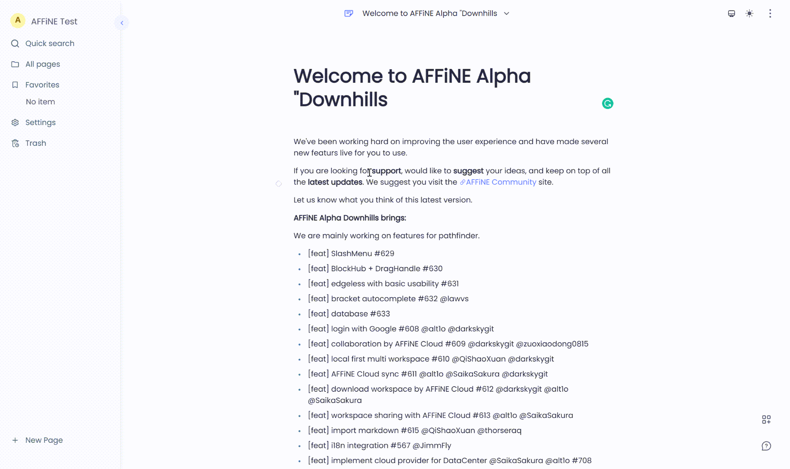
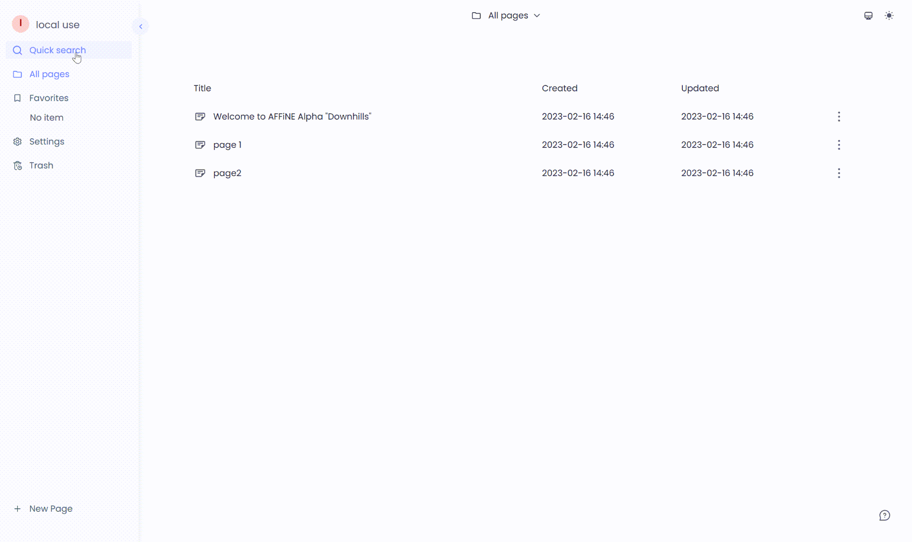
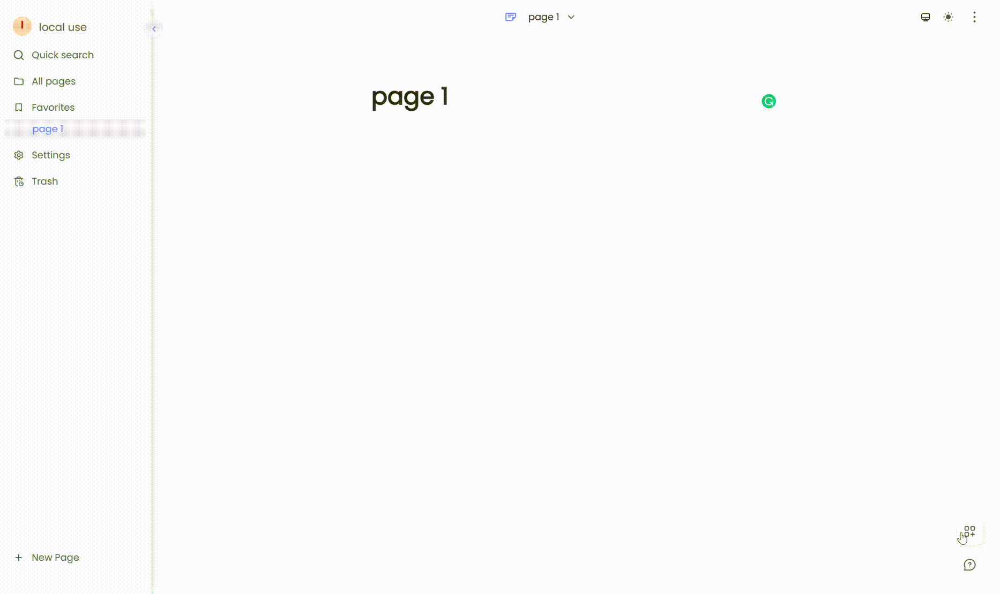
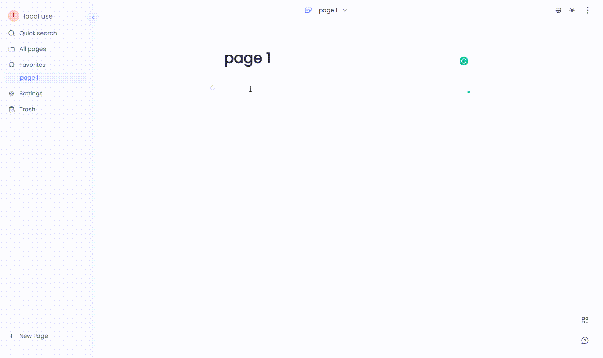
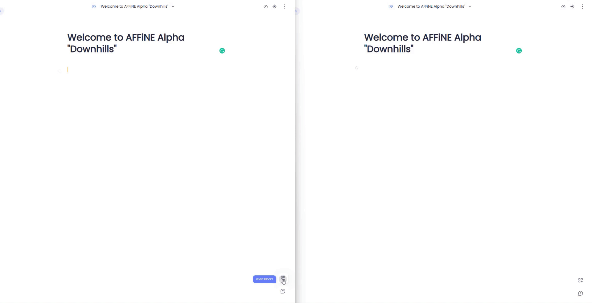
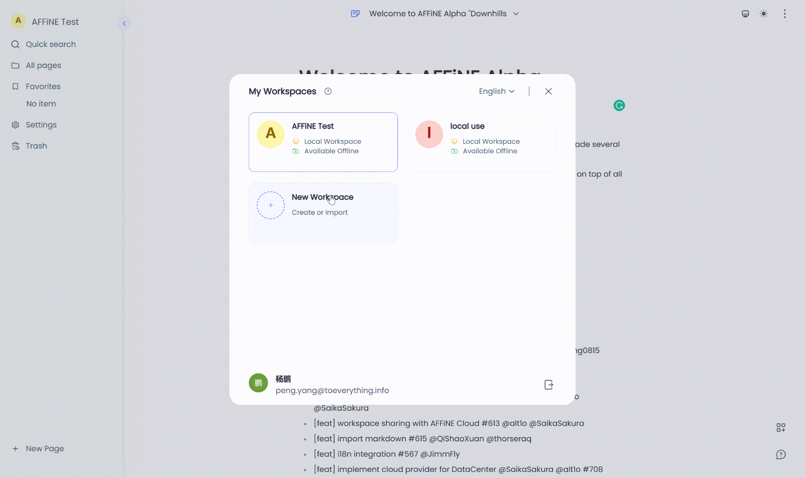

Here is the real blog content.

The content you write needs to conform to [the github markdown specification(GFM)](https://github.github.com/gfm/).

# Downhills release-Cloud sync, Workspaces, and more Blocks
# Preface
Everything we do from start to finish is **with the goal of creating a tool that provides positive real-life value to our community**. Whether you are writing a document, or getting creative in the Edgeless Mode (whiteboard). Whether you are working solo, with friends, or with colleagues. AFFiNE should work for you, so here are some of our latest updates:
## 1) A local-first, offline support, and privacy-focused workspace
Sometimes it's nice to have cloud apps. They may offer extra functionality and make it easy to access your data anywhere. Wouldn't it be nice if there was a way to enable cloud functions that would allow you to use the same app, but choose to store your data locally or on the cloud on a case-by-case basis? Maybe you are working on some sensitive or private content you don't want to be sent to the cloud. You may feel worried, and ask questions such as:
+ **Is my data safe or stored on “someone else’s computer”?**
+ **Is my cloud data vulnerable, might it be hacked?**
+ **What happens if the cloud service goes offline?**

Having access to your data, at will, is important and that's why we offer you the choice to customise your options and settings. With Downhills, your local workspace is automatically **saved and stored locally on your computer (using IndexedDB)**. So, you can easily backup and copy your data on demand. In addition, you are also able to create your local workspace without AFFiNE cloud, and experience the fluency of use even if it's offline.

## 2）More powerful workspaces to create and organise content
[Downhills](app.affine.pro) focus on your workspace. A place where you can access and organise all content; and a place where you are able to create content exactly the way you expect as just one person or together as a team.

1</li>. Content organisation: 

  + You can create a local workspace, create different pages and manage different types of content.

    
  + With "quick search", "favourites" and "all pages", it's much easier to organise your docs, just like this:

    

2</li>. Content creation: 

  + In your doc, the Block Hub empowers your documents with a wide range of blocks that can be seamlessly inserted with a simple drag-and-drop action. 

    

  + The Slash Menu provides you with a range of options to help edit your doc, from different blocks to various styling options. Simply type what you are looking for or use the organised categories from the left-side menu to explore what's available. 

    

## 3) Collaboration support in spite of local first
Privacy-first and local-first, can that be achieved while also offering collaboration? Yes, and we've done so in this update. Now you can share your workspaces with others and engage in a multiplayer experience. Here are some key things to take note of:

1</li>. **Better editorial conflict resolution**: 
+ ensuring a local-first experience, while also offering multiplayer collaborative editing was quite a challenge. However, we achieved it and compared to some of the other most popular block-editor providers on the market, we ensure that your data is always correctly synchronised to all endpoints. So, whether you are in asynchronous collaboration, online at the same time, or experiencing a network dropout, you don't need to worry about loss of data or sync collisions.

  

2.</li> **Cloud document collaboration**:
+ [Downhills](app.affine.pro) supports cloud collaboration within a workspace. With just the click of a button, you can upgrade your local workspace to a cloud one that offers you increased functionality, such as the ability to invite others to collaborate.

  

## 4）Special mentions
1</li>. **Big thanks to the i18n Group**

+ It takes a great deal of time, effort, and dedication from the community to update the various languages on offer in AFFiNE. We have a great appreciation for all those who are involved in, and have contributed to our i18n projects that allow AFFiNE to reach people from all over the world in their native tongue.

2</li>. **Why "Downhills"**

+ You may be curious where [Downhills](app.affine.pro), and even Abbey Wood come from. Well, the AFFiNE team took a trip to the UK and these are some of the names that stuck with us. In the case of [Downhills](app.affine.pro), we were planning to say goodbye to the UK but were hit with COVID. This meant we had to find somewhere to stay while we recovered, and that's when we came across the perfect house, right next to [Downhills](app.affine.pro) Park. It was a place where we stayed, a place where we worked together, a place where we lived together, and most importantly, where the [Downhills](app.affine.pro) has born.

3</li>. **About the product?**

  + **Clients version**: We want to let you know that we are working on clients version for AFFiNE, which will expand and improve the functionality that can be offered within the browser. They aren't ready yet and are still in development, but feel free to take a look at them on GitHub.
  + **Offline collaboration mode**: We are still considering if there is a way to help the type of cohort who happens to need to collaboratively edit highly sensitive content without the support of the cloud. This is exactly what we are working hard for, and we quite believe that the Local area network (LAN) can help solve this problem, and we assure you that there won't be a long wait to see the release of the new functionality.

3</li>. **Where to give feedback, requests, and recommendations**

Here are the official media accounts operated by AFFiNE. Thanks for your interest.
Any problems you come across, feel free to let us know through:
- Discord: https://discord.gg/Arn7TqJBvG
- Telegram: https://t.me/affineworkos
- Twitter: https://twitter.com/AffineOfficial
- Reddit: https://www.reddit.com/r/Affine
- Medium: https://medium.com/@affineworkos
- GitHub: https://github.com/toeverything/AFFiNE
- AFFiNE Community: https://community.affine.pro/home