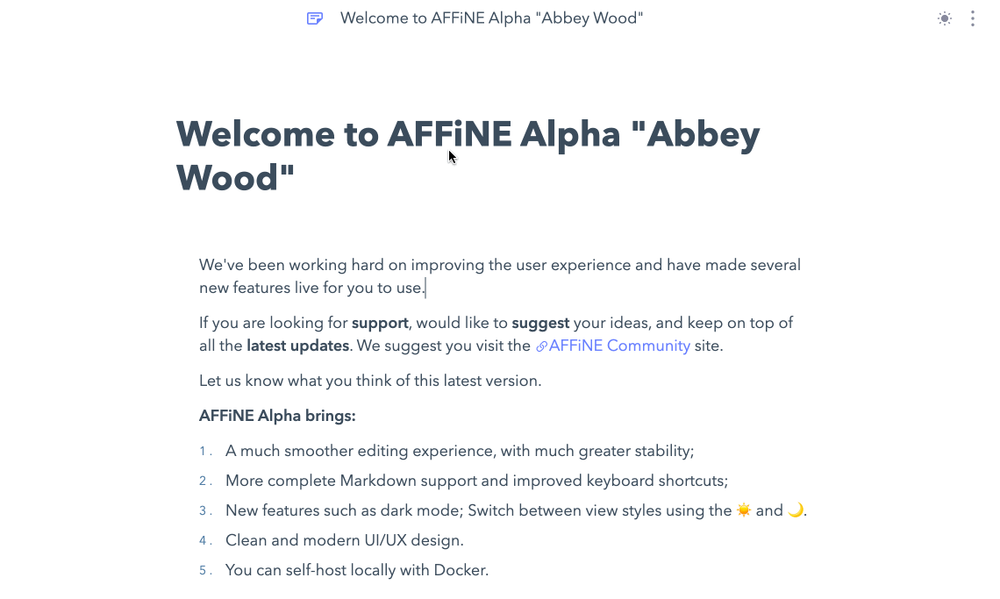

As you may have noticed our latest release, AFFiNE Downhills, introduces a new address - [app.affine.pro](https://app.affine.pro). We've done this for several reasons, and will explore them in this article. Also, with this change we will begin retiring old addresses - so it's vital you transfer/backup your content to avoid any data loss if you have previously relied on the [pathfinder.affine.pro](https://pathfinder.affine.pro) demo.

## Why we made the move

We are constantly improving AFFiNE to provide the best possible experience for our users. So now, with the latest release of Downhills we believe that our product has evolved to what we feel is a truly usable state. Hence, we have made the decision to setup and use the address: [app.affine.pro](https://app.affine.pro). This is the new home of the latest AFFiNE demo and we will begin to retire the old demos. It is a big step forward for us and our product, as well as our community.

Moving to this new address also also us to better configure and support the upcoming mobile and desktop clients we are developing. We can ensure that our product remain up-to-date for all of our users and provide the best experience across all devices and platforms with the latest features.

We were also concernde about the new workspace collaboration and multiplayer experience for our users. If you are sharing and publishing your workspaces, we don't want those links to break. So with this update we do not anticipate breaking changes to URLs and links so you will be able to continue to use the product without worry.

It shows how far AFFiNE has come from technical previews and live demos to a product that we have begin to use internally thorughout our workflows. It will be exciting to see how others begin to use and integrate AFFiNE too.

## What about my data?

In the latest [AFFiNE App (https://app.affine.pro)](https://app.affine.pro) you have more choices for your data. If you use a local workspace you should regularly export and/or save your data. Local workspaces rely on storage from your browser - so if you wipe your browser data you may lose all your workspaces and content. But that's where AFFiNE Cloud comes in.

With AFFiNE Cloud functionality enabled your workspaces can be synced to the cloud and so even if you change your device. or clear your browser data, you can just sign in to your account and sync the data onto your device.

Please do remember we are in active development, and still in Alpha. We do not anticipate any breaking changes that would cause data loss but it's good practice to have a backup strategy for your important data, such as the 3-2-1-1 rule:

*   Keep at least **three (3)** copies of your data.
*   Store **two (2)** backup copies on different storage media.
*   Store **one (1)** copy offsite.
*   Create **one (1)** immutable or air-gapped backup copy.

### Pathfinder

An important announcement is the [pathfinder.affine.pro](https://pathfinder.affine.pro) address is being retired. The new app address replaces this one, and builds upon the previous release. We have kept this version up to give you time to transfer your data, as any browser-stored data would be lost in the transfer to the latest app address. Simply use the export function to export your content as HTML or Markdown and save these to your local device. You could also copy and paste your data as required, to your new workspace over on [app.affine.pro](https://app.affine.pro).

## Conclusion

Moving to the new [app.affine.pro](https://app.affine.pro) address is a big step forward for AFFiNE and its development. We are excited about the future of our product and the community. If there are any changes you are unsure of, other other questions you have do not hesitate to reach out to us. We look forward to continuing to serve our community and prove the best possible experience to all of our users.

- AFFiNE Community: https://community.affine.pro/home
- GitHub: https://github.com/toeverything/AFFiNE
- Discord: https://discord.gg/Arn7TqJBvG
- Telegram: https://t.me/affineworkos
- Twitter: https://twitter.com/AffineOfficial
- Reddit: https://www.reddit.com/r/Affine
- Medium: https://medium.com/@affineworkos