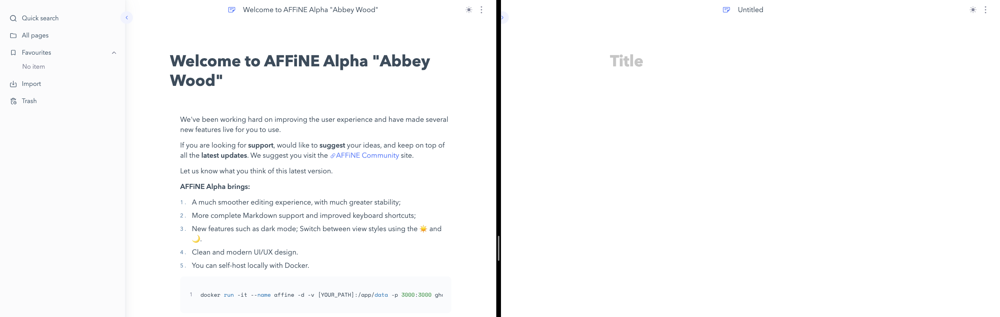
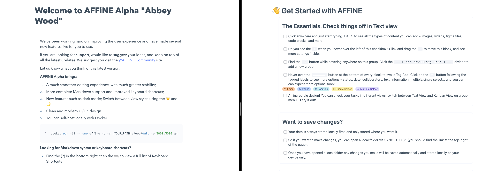

When you open AFFiNE you will notice that there is often a page pre-loaded with content. Whichever version you have used there has likely been some content for you to read, and some items to interact with. So why do we have this content, why not just dive straight into a blank page?

## Why?

Firstly, we should tackle why. As AFFiNE is experiencing rather rapid development, it means that there are often new features and functionalities being added. How can we effectively communicate these changes and allow for all of our community to better understand them and explore their uses?

If we added a new feature right now, how would you know about it? Maybe you might stumble across it in a menu. For a simple feature maybe that's enough - but for more advanced features, how can we help communicate the capabilities and possible configurations.
One way is through blog posts such as this one. We take the time to write instructions on how to perform operations and utilise features, supported with lots of images and gifs. That's a great way to communicate with our existing users and community, as well as those who may visit the blog. But what happens if someone visits the demo directly? How do they know where to begin?

## The troubles of a clean look

Aesthetics and consistency are important to us. We've gone for a more modest approach, with the idea being to keep things somewhat minimal, giving you more space to write with less distractions across the user interface. In fact, we continue to add functions and features that can be utilised via the keyboard to further improve your editing experience and maximise your efficiency.

So, when you open AFFiNE on a new, clean page, you might be forgiven for believing it's just another content editor. For those coming from more traditional software, such as Word - where are the toolbars? But AFFiNE is feature rich and capable of much more... so, with a clean design, how can we help communicate the capabilities and possibilities AFFiNE offers? How can we help you explore and learn AFFiNE without clogging up and filling your workspace with lots of tools and menus?

## The pre-load content

That's where the pre-load content comes in. This content is one of the first things you see when you try the AFFiNE app. It's a good chance for us to highlight important changes and any new features that have been added. It would also be a good place for us to show off what AFFiNE is capable of while giving you a chance to have a play with some of the features (without having to create and setup your own doc). A playground of content where you can try-out AFFiNE and some of its features quickly and easily. 

You can compare our first major Alpha release (left, Abbey Wood) with the last pre-Alpha release (right). We've try to keep the same idea of providing useful information - while also showing off some of the functionality that the application has to offer. So you can expect us to continue to develop and improve this page, particularly as more and more features are released publicly.

## Your feedback and ideas

Throughout our updates you'll find that the pre-loaded content is also updated. With new features, recent changes and other important information. We hope you find it a useful place to get started with AFFiNE and to learn what can be achieved. With that in mind we'd love to hear your thoughts. Do you find this pre-load content useful and engaging, or would you rather get started with a blank page? Do you keep an eye on our blog and read through our guides and tutorials? Would you like to see more resources, such as videos?

Your feedback and ideas are invaluable to us because this content is designed for you. So, let us know which parts you love, which parts you hate and how we can improve your experience. If you have anything to share, don't hesitate to reach out to us across any of our social channels.

- AFFiNE Community: https://community.affine.pro/home
- GitHub: https://github.com/toeverything/AFFiNE
- Discord: https://discord.gg/Arn7TqJBvG
- Telegram: https://t.me/affineworkos
- Twitter: https://twitter.com/AffineOfficial
- Reddit: https://www.reddit.com/r/Affine
- Medium: https://medium.com/@affineworkos
