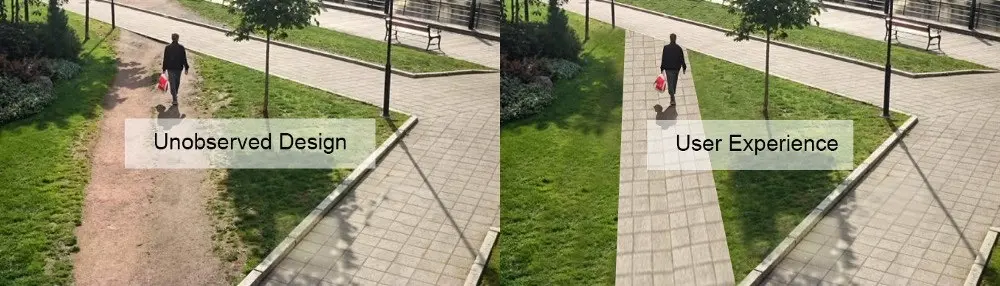
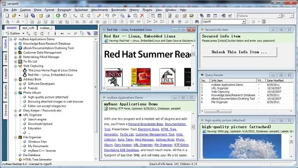
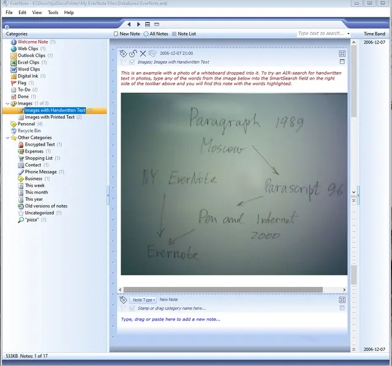
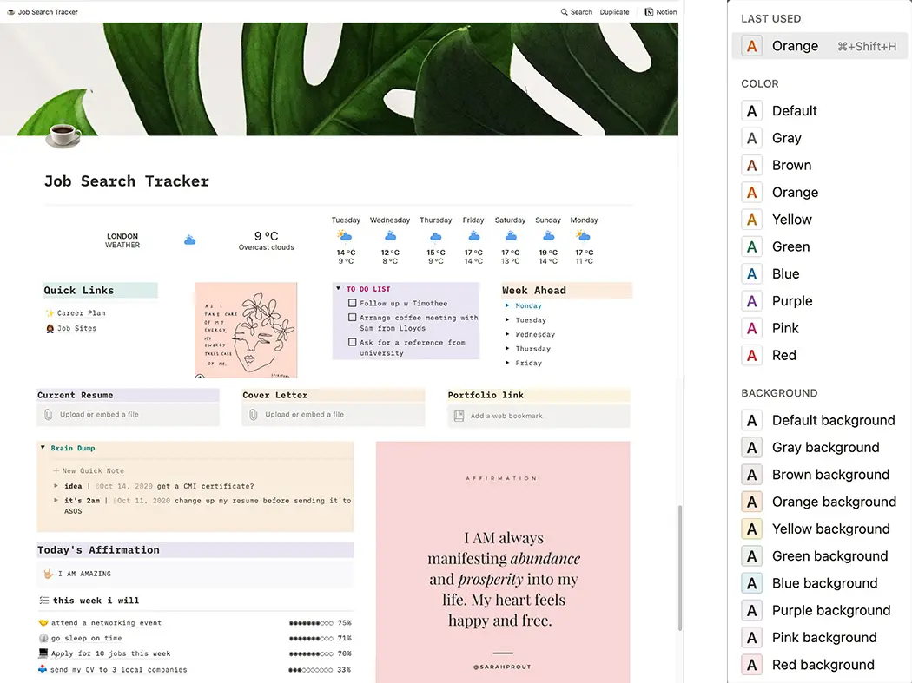
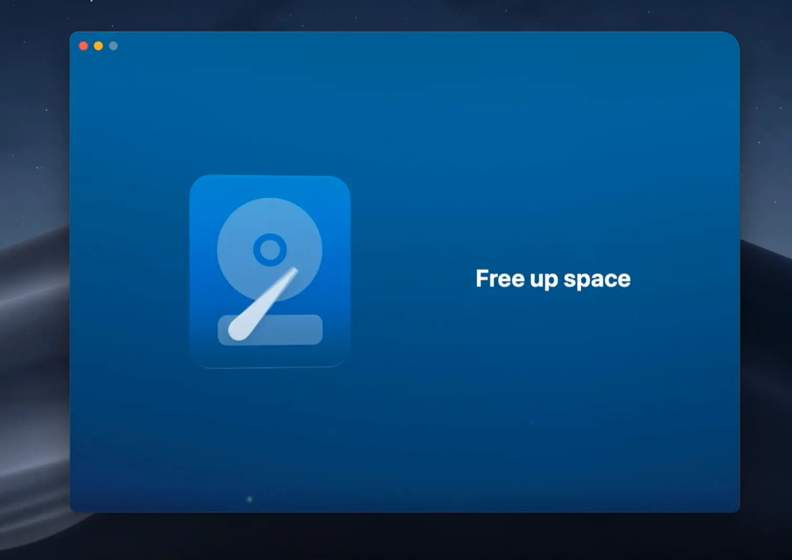

As a fortnightly event, UX Open Day plays two roles:

- a lecture about UX;
- a bridge connecting designers, developers and managers;

We hope that it deepens our understanding of UX, accelerates our R&D speed, and eventually reflects our slogan "To shape, not to adapt".

In this very first lecture, we talk about UX, its importance and the lessons we learned from other apps.

## What are we talking about when we talk about UX

### UX ensures that your product helps rather than hinders users

A cup that fulfills the principle of utility (that is to say, abosultely functional as a cup holding water) may not be a good cup in the sense of UX because its design hinders users instead of helping them:

### UX guides design and the subsequent development

A design solution, which did not consider UX, may not satisfy the need of users, even if it has some value in aesthetics. Users would like to seek a natural way to complete the task, like well-demonstrated in this picture:

During product development, it’s the duty of UX designers to seek the needs of users, then provide better solutions.

### UX is not another buzzword

- Usability = Usable User
- Experience = User-Friendly
- Usability: Can users accomplish their goal?
- User Experience: Is user experience as delightful as possible?

> The design is not just what it looks like and feels like. The design is how it works — Steve Jobs

## Ready for aesthetic challenges?

### Function first

Back to the old days (and the golden days of engineers), in a world where software fought hard to be useful, functions were the ultimate needs of final users, who focused mainly on how to fulfill practical tasks. Like my Base:

### Aesthetic rises

When there had been enough alternatives for users to choose, UIs, especially good-looking UIs, started to gain more attention. Like Evernote:

### Aesthetic rules

Nowadays, users are flooded with choices, they become too fussy and are paying more and more attention to the design. Intentionallly limiting users' choices becomes the dominant design solution. For example, the limited but carefully-selected color palette of Notion prevails over the traditional solution which is afarid of restricting users’ choices.

### Aesthetic is all

The increase of alternatives in almost every field will finally lead to the situation that UX become the decisive factor that users make their judgement.

Think of CleanMyMac X, it offers very basic file management functions that Apple itself has. However, it looks so good and simply by its look is enough to attract users.

### The Arms Race of UI/UX continues…

This situation challenges designers in both technical and aesthetical aspects. As the threshold of UX is being risen up higher and higher, even [a timeline](https://www.google.com/search/howsearchworks/our-history/) has to be very impressive in its visual presentation, so much so that it needs to be a work of art to please users.

## What are we talking about when we talk about UX in Affine

As a UX designer, making fancy, superficial requirements to the dev guys sometimes would be too offensive…

### The balance between Usability and UX regarding the approaching deadline of delivery/handoff

- Don’t be afraid of letting the low-fi prototyping to be a part of an MVP;
- Invite real users to take part in the heuristic evaluation;
- Try dedicated/professional user testing tools. 🔬2021 Design Tools Survey | UX Tools
