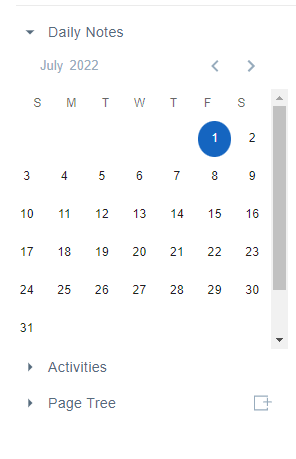

When you look around for an editor today, you may have come across the word "block editor". However, as to what exactly the word means, many are still confused. Yes, as the name suggests, it is consist of "blocks", but this is definitely not the only feature of a block editor.

# A Brief History

So far as I can trace, the idea of "block editor" as the way we approach it today is mainly (if not all) originated from Quip. According to Wikipedia \[1\]:

> Quip was founded by Bret Taylor, a co-creator of Google Maps, CEO of FriendFeed, and the former CTO of Facebook, along with Kevin Gibbs, who founded Google App Engine. Taylor founded the company in 2012, after leaving his position at Facebook. Roughly a year later, Quip was launched to the public as a mobile-centric tool for creating shared notes, lists, and documents. The app was well-received, winning accolades as one of the best apps of the year from Time, The Next Web, and The Guardian.

It gives birth to two very fundamental and iconic design elements that distinguish a block editor from all other rich-text editors. They are grid (or multi-column) layout and drag-and-drop-able block rectangle container. Quip tells us that you don’t have to sort your article by lines and all the column settings. You can stylize paragraphs and rearrange them side by side in any columns. It is simpler but more efficient.

## The story continues

Yelling “_software should be beautiful!”_, Notion, the most famous successor of Quip, goes a step further. It has removed almost all the editorial bars and buttons on a page, such as toolbar, sidebar and block menu.

Notion has created a range of data visualizers or so called “databases”, including kanban, list, gallery view, etc. They succeed in making a block editor not only a personal digital garden but also an all-in-one workspace for teams.

# A WYSIWYG Rich-text Editor is not necessarily a typesetting system

Just like in most print books, the layout of sentences, paragraphs, images and other ingredients in a traditional editor is configured in a typographical way, i.e. with row height, column width, etc. However, such a method is too complicated for most of the people. Complication inevitably leads to clumsiness, and even ugliness.

Block editor tells us that it can be done in another way. An editor does not have to be a typesetting system. Instead of doing it all by yourself, why not have it done by the editor? Instead of an intact typesetting system, an editor-complex with several purpose-made editors, such as date editor, image editor, might be better. For example, when picking dates, you’d rather want this:

Screenshot from AFFINE: this is just a “date editor”, isn’t it.

not this:

Screenshot from Word.

This is what a block editor is, a container of a collection of editors. You choose the data type of a block, and the block will be matched into a dedicated editor. In this case, your user experience is much better than using traditional editors.

# What are the must-haves for a block editor?

Let me use our own product AFFINE as an example to show you what are the must-haves for a block editor:

- blocks: content can be divided into and managed through various blocks;

Every sentence, paragraph, image or other content can be a block. The management of blocks is very flexible. You no longer need to select blocks to move them. A block is managed on Affine by its drag handle ⋮⋮ which enables you move it individually or collectivelly with other blocks to whereever you want.

- Grid system: to drag and drop blocks into resizeable columns;

- Balloon toolbar and other minimal handy menus: to keep UX clean;

- Multi-instance editors: the editor itself is a collection of editors responsible for different functions;

We offer a flexible transfer between different views of content. You can switch between table, to-do list and Kanban with just one click.

# Conclusion

Generally speaking, when using a block editor, you do not have the same level of freedom as using traditional editors such as Word. However, in another point of view, it saves you the time to do the layout and helps you focus on writing. If you do not demand too much for layout, block editor might be a better choice for you.

# References

\[1\]. Wikipedia. n.d. _Quip (software)_. Wikipedia. https://en.wikipedia.org/wiki/Quip\_(software)
