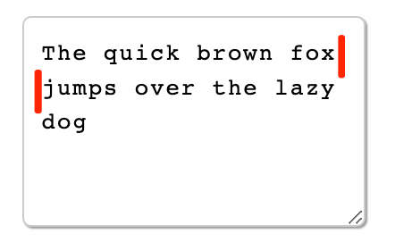

This article briefly explains cursor-related concepts in editor design, and how they are implemented in AFFiNE.

## Definitions

Before we understand what a cursor is, we should firstly understand what selection and range mean. Here is the official definition of "Selection".

> The [Selection](https://developer.mozilla.org/en-US/docs/Web/API/Selection) object represents the current position of the user-selected text range or insertion symbol. It represents a selection of text on the page, which may span multiple elements. A text selection is created by the user dragging the mouse over the text.

Selection models the selected state of the document. In a document tree, such selection states may span multiple subtrees and often have local offsets within a paragraph (e.g., when dragging a few words in a sentence). To accurately represent such states, the Web standard specifies that a single selection instance can contain one or more ranges, each of which can contain multiple document and text nodes, and also supports indexing local positions in the text.

While a selection can contain multiple ranges, the cursor is a much simpler case. As a simple definition, we can consider that **in an editor, when the user's selection starts and ends at the same position, this particular selection is the cursor**.

## Retrieve Cursor State

After knowing what a cursor is, we need to understand how to get the cursor state.

In general, the position of the insertion cursor can be obtained from the Selection object, which is then marked as Collapsed, which means that the selection is compressed to a single point at the cursor position.

The user may select text from left to right (the same direction as the document) or from right to left (the opposite direction of the document). The anchor points to where the user started the selection, and the focus points to where the user ended the selection. If we use mouse to select text, anchor points to where the mouse button is pressed, and focus points to where the mouse button is released. anchor and focus are not to be confused with the start and end positions of the selection, because anchor can point either in front of or behind where focus points, depending on where the user moves the mouse when selecting text. This depends on the direction of mouse movement when the user selects text (i.e., where the mouse button is pressed and released).

## Update Cursors

We can manipulate the cursor by creating a selection. This means creating a selection in the middle of the editor with the same start and end position, and using this selection to achieve the effect of switching the cursor.

## Cursor Design in AFFiNE

Since AFFiNE is using editor-block as its building blocks, each paragraph in it can be conceptualized as an editor instance. Therefore, AFFiNE‘s cursor does not directly use the browser's default cursor system and has to handle its own cursor jumps.

Therefore, special handling is required when the cursor is on the first and last line of text (otherwise, the browser default behavior is used). To do this, you should determine whether the "current cursor" is on the first and last line. To do this, we need to get the position information of the first and last character of the text, and then use getClientRects().item(0) to convert it to a "physical position object" to determine whether the top and first character are the same, and then decide the appropriate action.

Then we do the corresponding operation when the current is the top or bottom. For the text context, we pass the left value of the current cursor to the previous block, and then get the top or bottom according to the block position, and create a new selection with the left and top values, so that we can implement the cursor jump.

```typescript
if (document.caretRangeFromPoint) {
  range = document.caretRangeFromPoint(point.x, blockTop);
} else if (document.caretPositionFromPoint) {
  const caret = document.caretPositionFromPoint(point.x, blockTop);
  range = document.createRange();
  range.setStart(caret.offsetNode, caret.offset);
}
```

## Workarounds

When we are determining whether the cursor is on the first line, there is a small issue worth noting. Because of the way the browser is designed for cursor selection, when the user changes lines, the coordinates of the first character on the second line are the same as the coordinates of the last character on the first line, as shown in the figure below.



The two different red line positions in the figure have the same cursor state. This can cause the first line's coordinate position to be used in the calculation, but the user is actually using the second line's position. Therefore, we need to introduce a specifc workaround.

In AFFiNE, we take the positions of the "current character" and the "previous character" and compare their top values, and handle this special case by determining whether they are equal.

```typescript
const preRange = document.createRange();
preRange.setStart(nowRange.startContainer, nowRange.startOffset + 1);
preRange.setEnd(nowRange.endContainer, nowRange.endOffset + 1);
prePosition = preRange.getClientRects().item(0);

if (prePosition.top !== nowPosition.top) {
  // perform default actions
}
```

For AFFiNE-like editors, the cursor function usually requires similar extended handling. If you have encountered a similar problem, I hope this article is helpful to you.
