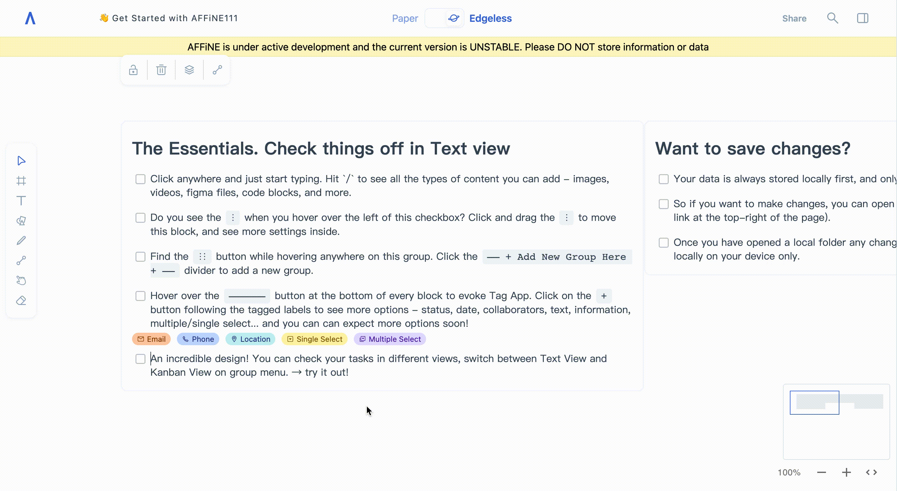
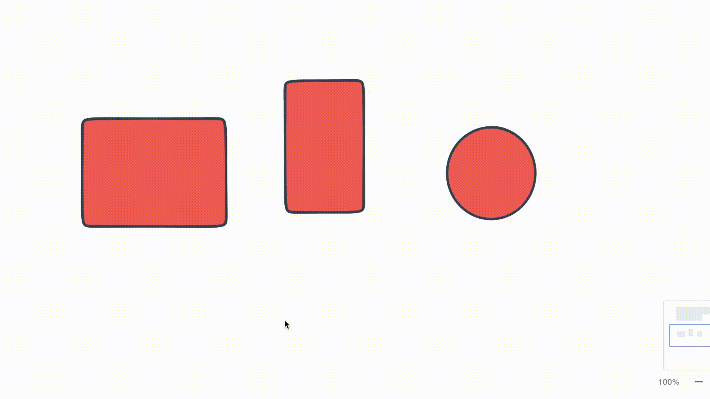

Thank you very much for your interest in AFFiNE! Some new and exciting changes are as follows:

### Features

- Feature: Live demo([https://livedemo.affine.pro/demo](https://livedemo.affine.pro/demo/affineNmS7TJ5dvE4ngEhS)) up and running;
- Feature: You can now click inside a block to edit directly in Edgeless Mode;

- Feature: Added layout function in Edgeless Mode;

- Feature: Added a menu option to insert a new block below.

### **Bug Fixes**

In AFFiNE team and users continued effort to make AFFiNE the most reliable all-in-one knowledge base, fixing bugs is always our main concern. Here's our work over the last few days:

- Fixed: In Edgeless Mode, selecting multiple blocks for group operation led to the website crashing;
- Fixed: In Edgeless Mode, zoom scroll jumps too fast from 10%-70%-250%;
- **Fixed: The mouse now will auto-focus when creating a new text input box in edgeless mode;**
- Fixed: The lock function didn't work if shapes were in block-groups;
- Fixed: '/' doesn't work after creating some new groups;
- Fixed: The command menu positioning that appeared did not meet expectations;
- Fixed: In Paper Mode, no background color could be added to the text;
- **Fixed: Pasting a link creates a new line - instead of inserting inline;**
- Fixed: A dividing line displays when dragging the block with the mouse, but this line remained after the operation is finished in paper mode;
- Fixed: Added arm64 Support to the Docker Images.

### Improvement

In AFFiNE team and users continued effort to make Affine the most reliable all-in-one knowledge base, optimizing user experience is always our main concern. Here's our work in the last few days:

- Improvement: Edgeless Mode toolbar tooltip changes;
- Improvement: When clicking on a link, it will now open in a new tab;
- Improvement: Button colors of transform changes;
- Improvement: Sidebar changes in Paper Mode;
- Improvement: The icon of the top toolbar is updated in Paper Mode;
- Improvement: The page tree item will change the background when the mouse enters;
- Improvement: The space between list items has been decreased;
- **Improvement: Made it easier to create grids, such as nested grids;**
- Improvement: List adds a shadow box in the Paper Mode sidebar;
- Improvement: Use of drag hand style when dragging in Edgeless Mode;
- Improvement: When selecting multiple blocks with the mouse, we’ve added a style to separate the blocks;
- Improvement: A prompt is now given when the page link is copied.

AFFiNE is currently in the early alpha stage with limited access, and public early access will be available in the autumn of 2022.

AFFiNE is an open-source project which can be viewed on Github:[https://github.com/toeverything/AFFiNE#readme](https://github.com/toeverything/AFFiNE#readme)

The official website for AFFiNE is[https://affine.pro/]()

If you endorse this open source project, please help us by clicking the GitHub star, which is crucial for the future development of AFFiNE.

AFFiNE is very grateful to all open source contributors and will work to build a more positive open source ecosystem.

We welcome every user to offer feedback and suggestions. Please feel free to contact us on:

- Reddit:[https://www.reddit.com/r/Affine/]()
- Discord:[https://discord.gg/Arn7TqJBvG]()
- Telegram:[https://t.me/affineworkos]()
- Twitter:[https://twitter.com/AffineOfficial]()
- Medium：[https://medium.com/@affineworkos](https://medium.com/@affineworkos)

Hope you have a nice time with AFFiNE!
