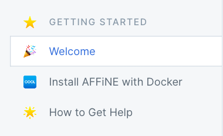
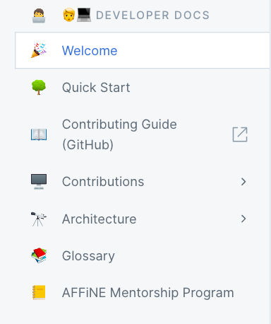
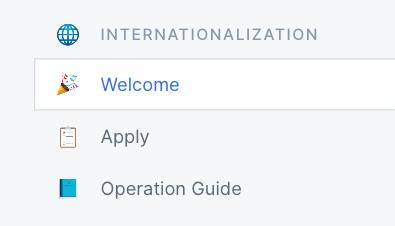
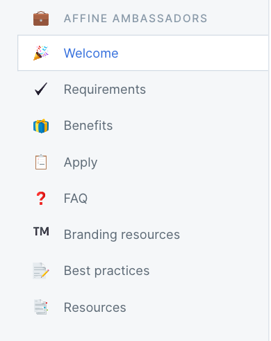
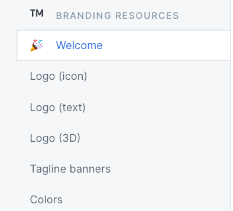
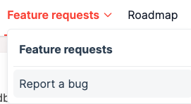
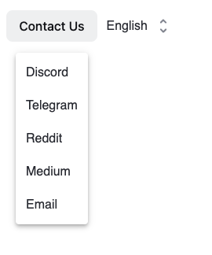
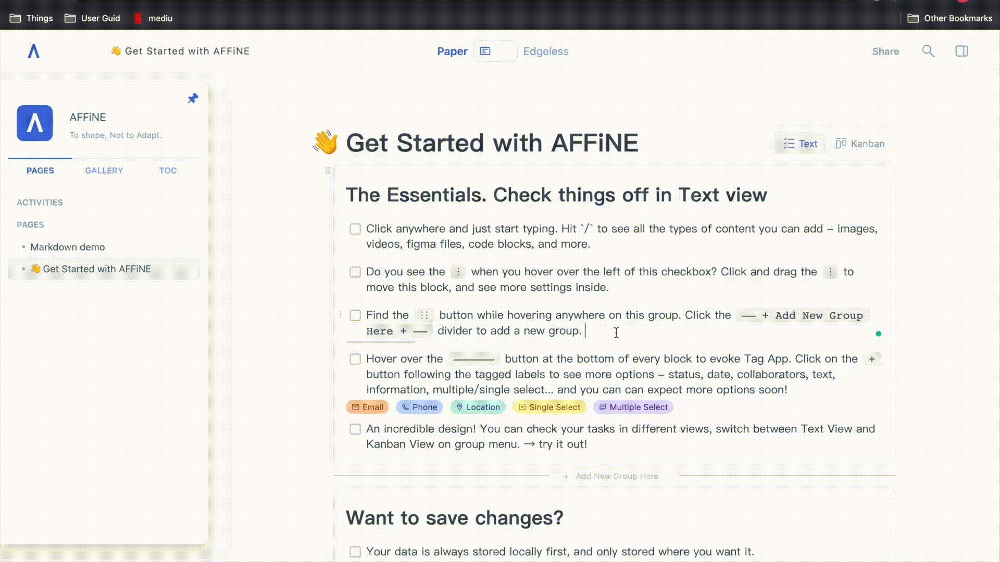
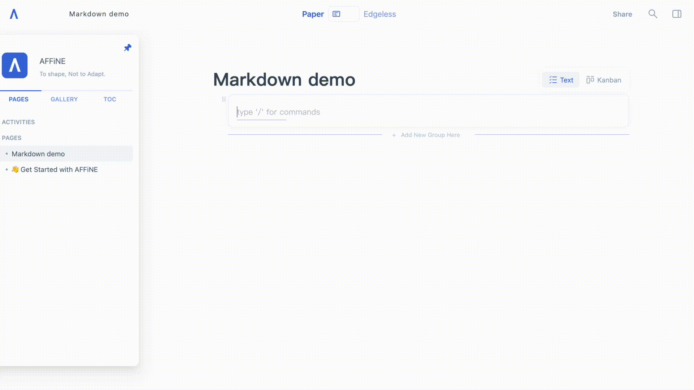

We have been working hard on the live demo to optimize features for our users. Today we will share with you the results of the team's work, including new features, bug fixes, and the launch of a user feedback channel：

### Fundamental Change on Landing page & Live Demo:

You may have noticed minor changes to both our official website & live demo. Here are some of the things that have changed:

### **Official Website：**

First, let's introduce what changes we have made to the official website! We have added several new sections to the navigation bar: Doc, Feedback, Contact Us, and more.

**1\. Docs**

- **Getting started:**The recent feedback from users is the online help manual, so you can get the help you want here.

- **Developer Docs:**As an open-source project, we are looking forward to having more talented developers participate in our project. There have details on how to use the AFFiNE open source project. You can find other content here, such as AFFiNE technical articles, AFFiNE Contributions, etc. We welcome you to be a part of our open-source community

- **Internationalization:**AFFiNE is a diverse and friendly team, and while we use English as a common way to communicate, there are many languages around the world. We are using the Tolgee tool to help more users use AFFiNE smoothly. If you are interested in AFFiNE multilingualism, you can request access through the invite link.

- **AFFiNE Ambassadors:**AFFiNE is running an ambassador campaign, and we are honored to invite more users to join the ambassador program and join me in communicating the values of AFFiNE. As an AFFiNE Ambassador, AFFiNE will also look to help you and we hope to provide a mutually beneficial relationship.

- **Branding Resources:**You will find official branding resources, such as logos and posters for AFFiNE.

**2\. Feedback**

We have recently opened a user feedback channel, where we have gathered features & bugs from our users. Until now, we have collected lots of suggestions from users here. If you like the idea of some of the feature requests, don’t forget to upvote to let us know that those suggestions are in high demand.

- For features: [https://feedback.affine.pro/boards/feature-requests](https://feedback.affine.pro/boards/feature-requests)
- For bugs: [https://feedback.affine.pro/boards/bug-reports](https://feedback.affine.pro/boards/bug-reports)

**3\. Contact Us**

AFFiNE is available through multiple media platforms. Please feel free to contact us over your preferred method.

### Live Demo:

**1\. Sync to disk**

The AFFiNE live demo implemented previously used a 'sync to disk' feature that required several extra privileges and steps. We heard your feedback about this function and the limitations for some of our self-host users and compatibility issues in some browsers. So, we made some changes in the backend.

Go to the settings panel on the right and choose to import/export your data. Please do note that this does however mean that previous files from an older version of AFFiNE may no longer work.

### New Features:

**1\. Bi-directional links**

You can use the shortcut \[\[\]\] (square bracket) in the article to create bi-directional links now, and the created links will be automatically synchronized to the file list.

**2\. Markdown**

Markdown can help users to improve efficiency. We have also been improving the markdown syntax editing experience in AFFiNE, and users can now use it to create in the editor. (Now, only common syntax is supported after updating more markdown syntax.)

### Bug Fixed:

- **Fixed: 'Command+A' shortcut key experience enhancement on Mac;**

  - Before: 'Command+A' shortcut would select the current block and then the whole page;
  - Now: When the mouse focuses on group blocks, the first 'Command+A' selects the current block, the second 'Command+A' selects the current group block, and the third 'Command+A' selects all articles.

- **Fixed: The cursor can switch from the text block to the code block seamlessly;**
- **Fixed: The cursor focuses on code blocks automatically after code blocks are created;**
- **Fixed: After selecting the block & group block in paper mode by Ctrl+A, the delete key can delete it directly;**
- **Fixed: The cursor lost in the article was solved.**

The recent changes of AFFiNE are to serve everyone better and to provide a foundation for the rapid development of AFFiNE. AFFiNE has received a lot of suggestions and encouragement from our users since its launch, and we are very grateful for your support. We welcome every user to offer feedback and suggestions. Please feel free to contact us on:

- Reddit:[https://www.reddit.com/r/Affine/](https://www.reddit.com/r/Affine/)
- Discord:[https://discord.gg/Arn7TqJBvG](https://discord.gg/Arn7TqJBvG)
- Telegram:[https://t.me/affineworkos](https://t.me/affineworkos)
- Twitter:[https://twitter.com/AffineOfficial](https://twitter.com/AffineOfficial)
- Medium: [https://medium.com/@affineworkos](https://medium.com/@affineworkos)
- Official Website: [https://affine.pro/](https://affine.pro/)

Hope you have a nice time with AFFiNE!
