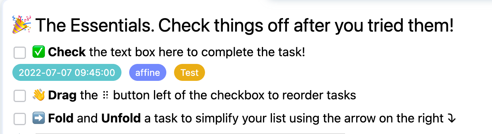

**Thank you very much for your attention to AFFiNE！**

**Some exciting changes in AFFiNE are as follows:**

#### New Features

- **Group**

  - Quick insert: type "---" and press space;
  - Merge/Split：
    - Select and merge multiple groups;
    - Split a group into two groups.

<video><source /></video>

- Add tag apps to any individual block;

<video><source /></video>

- **TODO LIST**

  - Inline menu：
    - Bold, italic, code block, background color, font color;
    - List.

- **Board**

  - Editing blocks;
  - Add Frame;
  - Add several Shapes;
  - Switch Group into Kanban;
    - Link Connector with Kanban.

<video><source /></video>

- **Others**

  - Add multiple templates;
  - Enable block dragging

### **Bug Fixes**

In our continued effort to make AFFiNE the most reliable all in one knowledge base 展开, fixing bugs is always our main concern. Here's our work in last few days:

- Fixed: Wrong icons for Bulleted list and Numbered list;
- Fixed: Invalid shortcut / for Command menu;
- Fixed: Copy & Paste:Block Editor copy and paste invalid
- Fixed: Cursor jumping:Press enter to change lines above an image or video and the screen position will jump straight up
- Fixed: Page shaking when switching between Kanban and Whiteboard;
- Fixed: Failed inserts of image & file;
- Fixed: Invalid image block resize;
- Fixed: Incorrect display of Popovers.

AFFiNE is currently in the early alpha stage with limited access and public early access will be available in the autumn of 2022.

AFFiNE is an open-source project which can be viewed on Github: [https://github.com/toeverything/AFFiNE#readme](https://github.com/toeverything/AFFiNE#readme)

If you endorse this open source project, please help us by clicking the GitHub star, which is crucial for the future development of AFFiNE.

AFFiNE is very grateful to all open source contributors and will work to build a more positive open source ecosystem.

Hope you have a nice time with AFFiNE!
