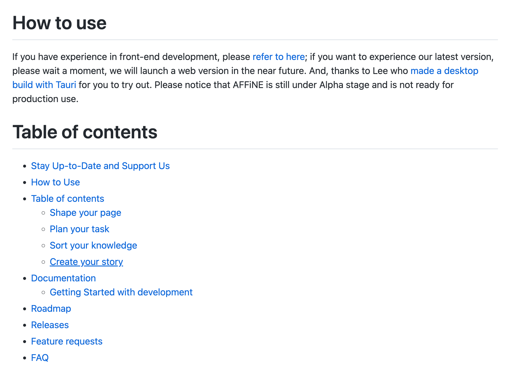

**Thank you very much for your interest in AFFiNE! Some exciting changes are as follows:**

### **New Features**

- Instructions for online use;

- The kanban view now supports grouping by status.

### **Bug Fixes**

In our continued effort to make AFFiNE the most reliable all in one knowledge base, fixing bugs is always our main concern. Here's our work over the last few days:

- Fixed: In doc mode, the text content is obscured by the menu floating box;
- Fixed: The size of the left menu trigger button is wrong in page mode;
- Fixed: In doc mode, when clicking the 'add tag' icon after selecting multiple blocks with the mouse, the page will be stuck;
- Fixed: When opening multiple file menu within sidebar in doc mode, the menu boxes will block each other;
- Fixed: There is a bug in the rename workspace name function in doc mode;
- Fixed: When the user presses the shift key to draw consecutive straight lines, the second line's starting point coincides with the first line's ending point;
- Fixed: The block delete button (located in the left menu) does not work in the grid scene of page mode.

AFFiNE is currently in the early alpha stage with limited access, and public early access will be available in the autumn of 2022.

AFFiNE is an open-source project which can be viewed on Github: [https://github.com/toeverything/AFFiNE#readme](https://github.com/toeverything/AFFiNE#readme)

If you endorse this open source project, please help us by clicking the GitHub star, which is crucial for the future development of AFFiNE.

AFFiNE is very grateful to all open source contributors and will work to build a more positive open source ecosystem.

We welcome every user to offer feedback and suggestions. Please feel free to contact us on:

- Reddit:[https://www.reddit.com/r/Affine/](https://www.reddit.com/r/Affine/)
- Discord:[https://discord.gg/Arn7TqJBvG]()
- Telegram:[https://t.me/affineworkos](https://t.me/affineworkos)
- Twitter:[https://twitter.com/AffineOfficial](https://twitter.com/AffineOfficial)
- Medium：[https://medium.com/@affineworkos](https://medium.com/@affineworkos)
- GitBook: [https://docs.affine.pro/affine/]()

Hope you have a nice time with AFFiNE!
