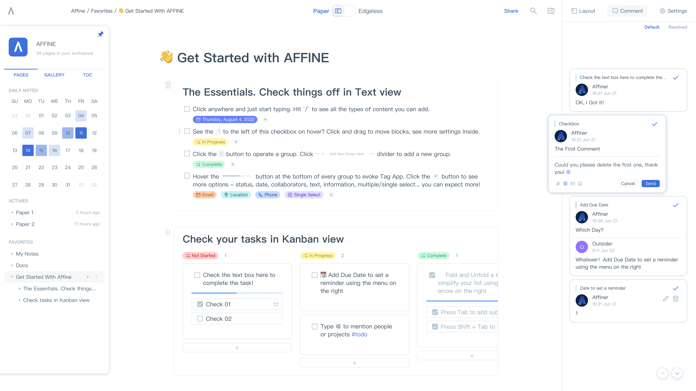
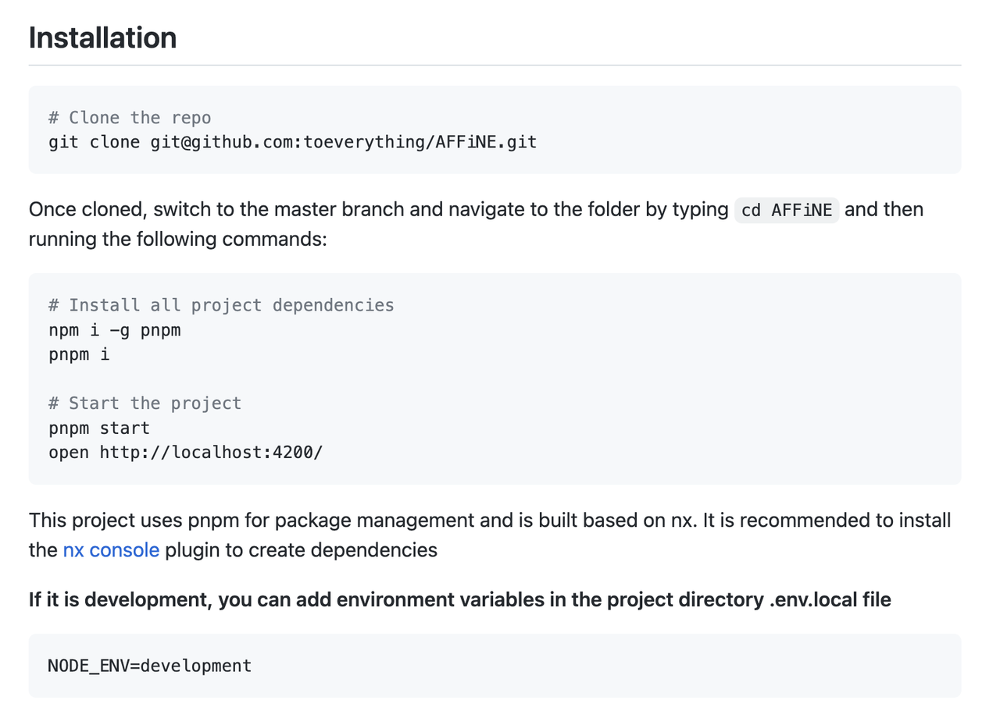

While Miro(visual collaboration platform) and Notion(note-taking tool) are silky smooth and powerful enough to use, they are not open source solutions.

So, what about the next-gen knowledge base that is more private, transparent, customizable, and available for Windows/OS/Linux？

That's where AFFiNE sparkles!

Unlike Miro and Notion, which focus on whiteboard and page, AFFiNE defines its positioning as an all-in-one KnowledgeOS. It supports kanban, table, and rich-text paragraphs as building blocks to form pages or whiteboards. It carries out integrated processing here in document editing, data processing, or brainstorming.

Build with Rust and Typescript, and run the entire project with one command line, AFFiNE gives all developers maximum imagination in the simplest way.

## **AFFiNE is a Perfect Combination of Privacy and Experience of Developer and User**

AFFiNE is fairly new.

It is an open-source project that aims to overcome some limitations of [Notion](https://www.notion.so/) and [Miro](https://miro.com/) in terms of security and privacy. It helps you carry the to-do list recorded in the meeting, the goal written in the document, the brainstorming on the whiteboard of the video conference, and the feedback obtained in the customer interview in a unified place. AFFiNE can become a place to store, integrate and manage all workflows.

On the basis of safeguarding data security and user privacy, the experience of users and developers also matters. And, AFFiNE does a decent job at it, if not better than Miro and Notion.

Note that AFFiNE is still in its alpha phase.

Currently, the aim of this project is not only for functionality, but also for a customized experience, community-driven opportunities, and data privacy.

### **Notion vs. AFFiNE: What Are Your Priorities?**

While it is meant to replace Notion as an open-source solution, it may not be for everyone. So, if you are going to choose AFFiNE over Notion, you will get the following benefits:

#### **Privacy**

[Notion](https://www.notion.so/product) can be used as closed source software to directly access your private data in the cloud. Compared to this, you can host AFFiNE as per your preference.

With AFFiNE, you own your data, no matter what. With no sacrifice to collaboration and share, all your data, along with a slice of AFFiNE itself, is in your hand.

#### **Transparency**

AFFiNE is an open-source project, so you are always welcome to modify and view the code.

#### **Performance and Native Experience**

AFFiNE is built using Rust and typescript, which provides a modern and stable user experience while maintaining performance.

AFFiNE is fully built with web technologies so that consistency and accessibility are always guaranteed on Mac, Windows, and Linux. _The local file system support will be available when version 0.0.1beta is released._

## **Features of AFFiNE**

### Shape your page

An always good-to-read, structured docs-form page is the best for your notes, but a boundless doodle surface is better for collaboration and creativity.

We make the shift and reshape easy, so you can shape the docs your way.

With AFFiNE, every page comes with 2 views, and you can access and edit fully functioned blocks anywhere, in any form.

### Plan your task

We really appreciate the idea of Monday, Airtable and Notion database. They inspired what we think is right for task management. But we don't like the repeated works -- we don't want to set a todo easily with markdown but end up re-write it again in Kanban or other databases.

With AFFiNE, every block group has infinite views, for you to keep your single source of truth.

### Sort your knowledge

A good, semantic knowledge base is made of reusable, linked elements. AFFiNE is completely made on top of the idea of blocks. Blocks can be 2-way linked, duplicated, reused, and synced between docs.

As semantic web lovers, we don't like the idea of folders that much, and we make everything easy to find.

The biggest function of AFFiNE is that any block can be converted with one click: the page editing mode + Kanban view mode + whiteboard mode can be seamlessly linked - making it easy, convenient, and burden free for all users to use.

In addition, AFFiNE has more page views and whiteboard views, which can help different users brainstorm and align progress with other partners at any time while precipitating and processing data sets, and write data-related reports and complete meetings without changing the working tools flow.

You can expect more feature additions as the development continues. Some existing highlights include:

- Native cross-platform support.
- Add to-do in text mode, and transform to board mode.
- Ability to self-host it or install it on your computer.
- Customizability.
- Data privacy (top priority).
- A single code base for better maintenance.
- Community-driven extensibility.
- Multi-column view and advanced formatting support.
- Click anywhere and type with MarkDown support.
- Keyboard shortcuts for editing cell/grid.

### **Installing AFFiNE on Linux/Windows/MacOS**

In either case, you can check AFFiNE’s [official documentation](https://affine.gitbook.io/affine/) to build it from the source. Explore more about it on its [official website](https://affine.pro/).

## **Wrapping Up**

If you need a simple Notion-like or Miro-like application with a native experience, AFFiNE is an interesting choice.

AFFiNE has a variety of views such as whiteboard, and document editing, and different views can realize data linkage and one-click switching. Any block element can be easily reorganized and reused to help users reduce invalid working hours, improve work efficiency and release time on work with more creative value.

Therefore, in 2022, if you want to have a tool that can store, integrate, manage and create all workflows, you might as well try AFFiNE!

If you are interested in AFFiNE after reading this article, please click here to know more: [https://github.com/toeverything/AFFiNE](https://github.com/toeverything/AFFiNE)

If you have any questions about productivity tools or AFFiNE products, please feel free to ask questions on Reddit: [https://www.reddit.com/r/AFFiNE/](https://www.reddit.com/r/Affine/)

Hope you have a nice time with AFFiNE!
