Thank you for your interest in AFFiNE.

The live demo of AFFiNE has officially launched, as promised, on August 12, 2022. You can directly access the demo here: https://affine.pro/

Some things to consider about the demo:

\- Designed and optimized for the **chromium-based browser**(such as Chrome or Edge) – some functions such as local file storage may not work correctly in other browsers.

\- AFFiNE is still in development and the product is **not production** ready. Please do not store any important information or data as there may be breaking changes moving forward.

\- We look forward to sharing a more **detailed roadmap** with you next week. You’ll find more about our intended direction and some of the new upcoming features we have planned – so stay tuned.

The live demo allows us to show off several key features:

\- **Paper Mode** - a space for you to freely explore and utilize the product, and we believe it offers a better experience than Notion – we hope you do too.

\- **Edgeless Mode** – a space that gives you the freedom to draw and create through a blank canvas.

\- **Kanban View** – which is feature-rich and allows custom grouping.

\- **Seamless switching between Paper Mode and Edgeless Mode** – this is one of our proudest features of this release – and something we see that really sets us apart from a lot of other products.

If you want to continue to learn more about AFFiNE, we recommend you refer to an earlier article of ours. Here you can learn more about the product and some of its features:[https://blog.affine.pro/posts/affine-the-next-gen-knowledge-base-to-notion-and-miro](https://blog.affine.pro/posts/affine-the-next-gen-knowledge-base-to-notion-and-miro)

And for this live demo release, to help you better understand and use AFFiNE, we interviewed some of the engineers and designers from the AFFiNE Team. Here is what they had to say:

## Product Design:

- **Fanjing & Guozhu：** AFFiNE, the state-of-the-art block-based editor, is a convertible mixture of documents and whiteboards that allows for organizing contents by variable structures and views. The idea of "a white paper with infinite extension" is the original design concept. So, you can have an article, a task list, a whiteboard, or something else which can then be easily shared. This opens up the possibilities of collaboration, where people and teams can work together and draw together – a free space and canvas for your data. This was our initial idea, and the design language will continue along this line in the future.

- **Yifeng:**AFFiNE believes that knowledge is a single source of truth data model and that tools are just different forms of representation. From plain text, to lists, to kanban, to grids, and to whiteboards, AFFiNE allows knowledge to be smoothly transitioned and elegantly manipulated between these forms, and protects your data ownership with a local-first, privacy-first architecture - and finally, don't forget that the code that makes it all happen is fully open source.

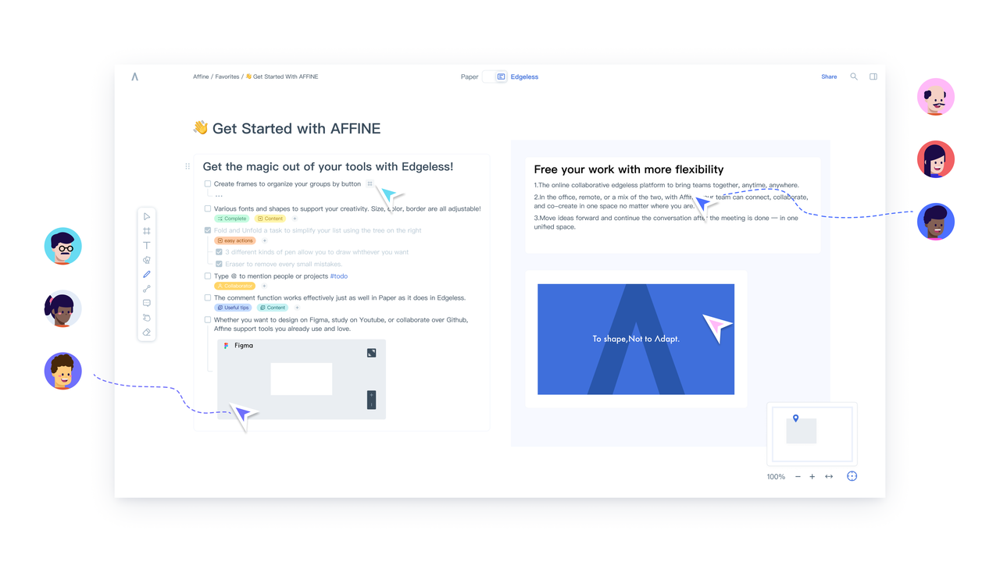

- **Chi Zhang:**AFFiNE is a next-generation collaborative knowledge base where any of your ideas, notes, and work information can be easily brought together in a blocked editing experience with a great Markdown editing experience and silky-smooth cross-platform copy-and-paste capabilities.

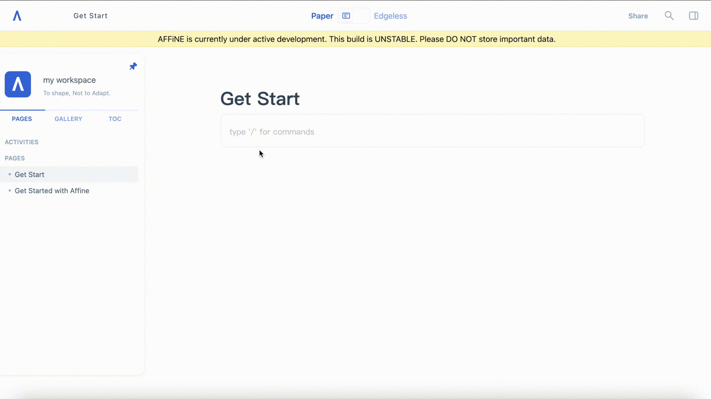

- **Shiwen:**AFFiNE is so clear and intuitive. It's ready-to-use and the visual interface lets users jump in and get started, without any training. Views in Text, Kanban, and Table allow you to transform your data the way you want - from colorful and complex to simple and muted.

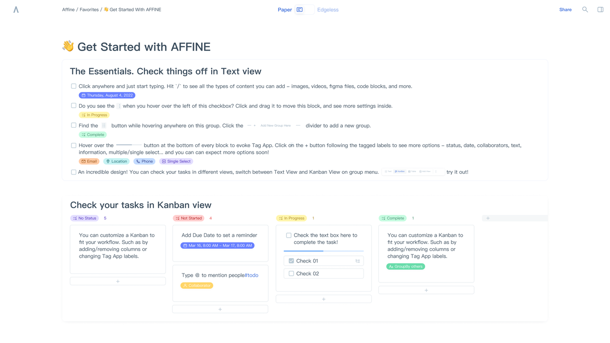

### **Tag-app System:**

- **Shaoxuan:**The tag-app system not only provides standard tagging functions for each block, but also helps with progress status management. In the Kanban View, the tag-app will be converted into the table header of Kanban to facilitate the quick transition of task status.

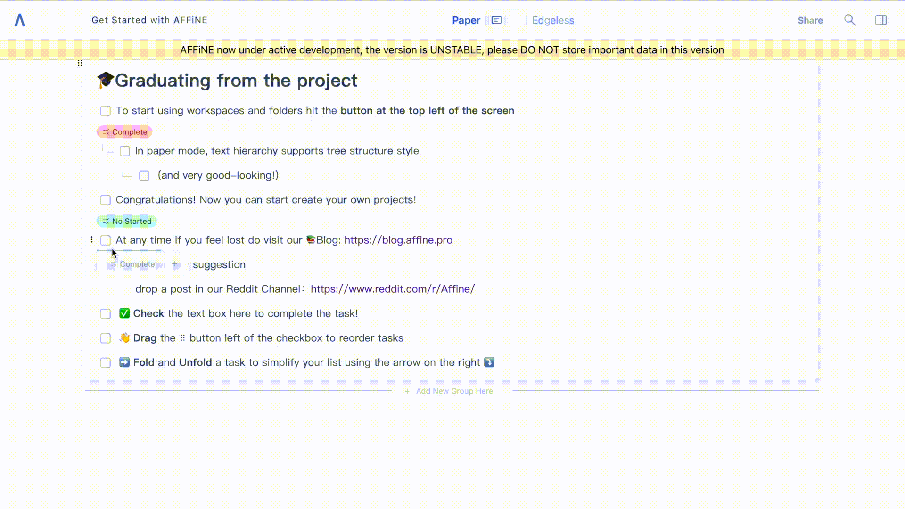

- **Fangyuan:**AFFiNE supports a seamless transition from the text view to the kanban view. After converting a to-do list to kanban, the view will be automatically updated to the corresponding column of kanban according to the list status or label. This allows us to truly realize and appreciate the 'synchronization of multiple changes in one place'.

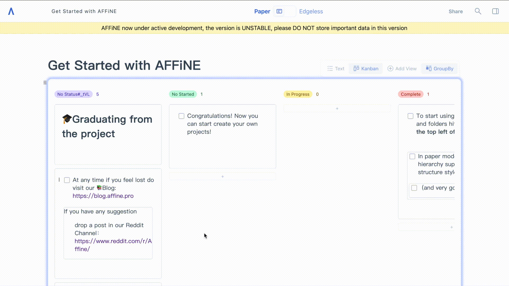

### **Edgeless Mode:**

- **Haoxin:** Edgeless mode supports Frame function, as long as within the selected Frame range, any Block created will move together with it.

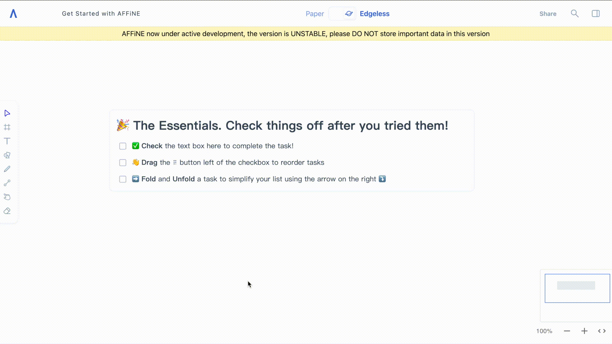

### **Paper Mode:**

- **Sicong:** In Paper mode, any Block can be dragged and dropped freely (with more freedom than Notion!)

- **Sicong:** The Gap between different Blocks and multiple Block Groups has a visual dimension that looks clear and simple.

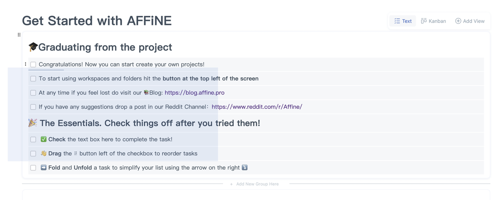

- **Cankun:**In paper mode, text hierarchy supports tree structure style (and is very good-looking!)

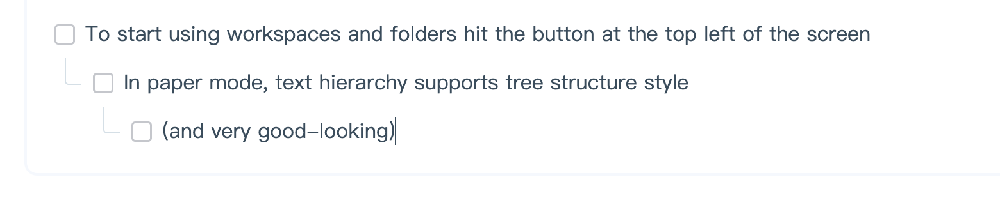

- **Mingliang:**The Grid layout in Paper mode is very smooth, supports multi-column mode, and supports free adjustment of the width of any column.

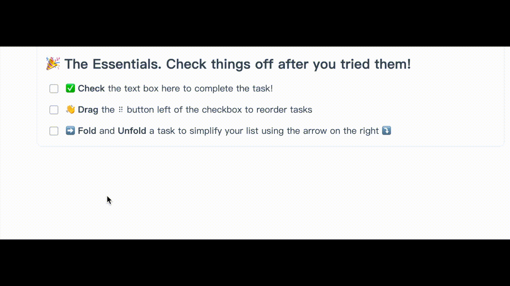

### **Kanban View:**

- **Jiawei & Xiaodong:**Under the Kanban View, cards can be dragged and dropped to quickly adjust their order and status.

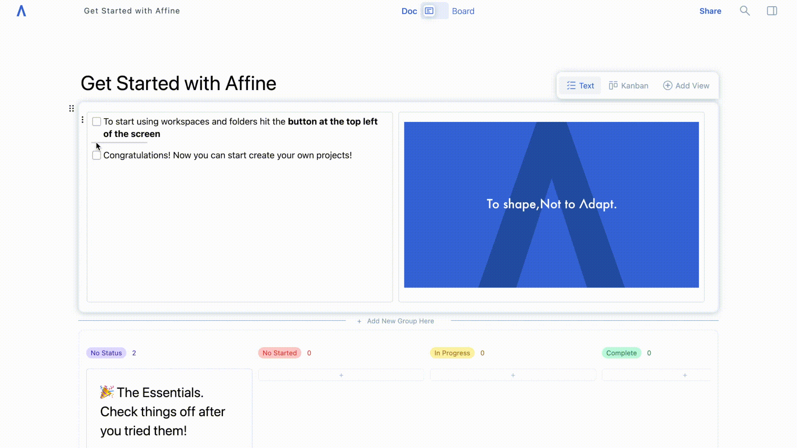

### **Local Storage of data:**

- **Xinglong & Wenhao:**Support for local storage of data, which means that local files can be synchronized instantly in the cloud (e.g. dropbox, iCloud)

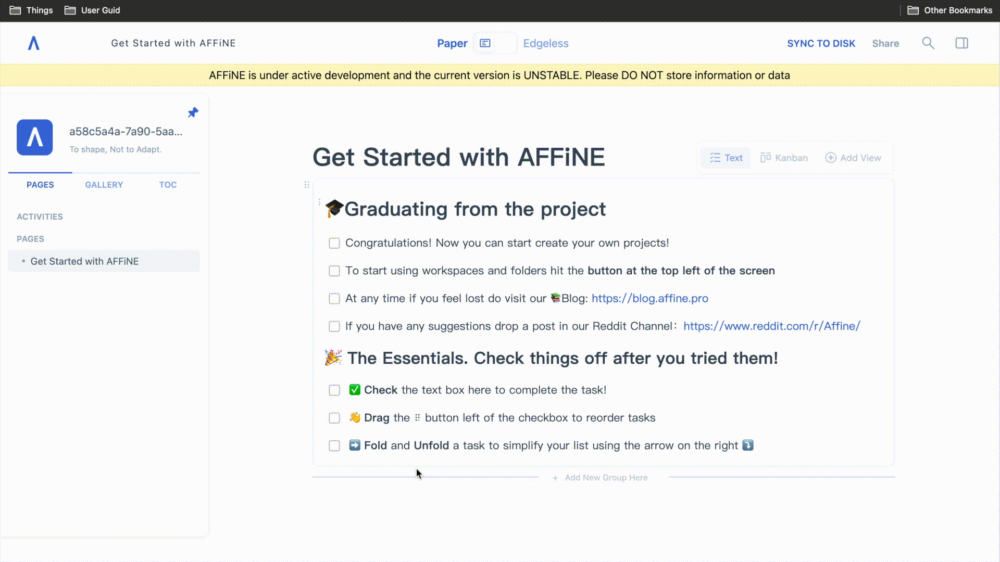

### **Basic Experience:**

- **Haoxin:** In terms of basic experience, the keyboard cursor experience is very smooth when switching between Blocks or switching across Blocks, e.g. keyboard up/down/left/right selection & carriage return event & quick marker.

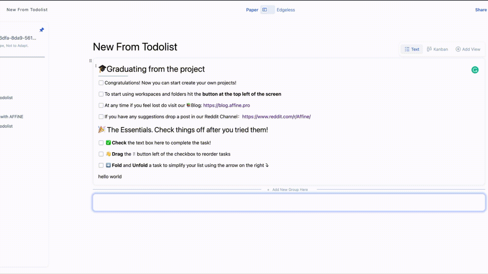

- **Mingliang:**Users can experience silky smooth selection of different Blocks and Block Groups, and the positioning of the selection cursor is very accurate.

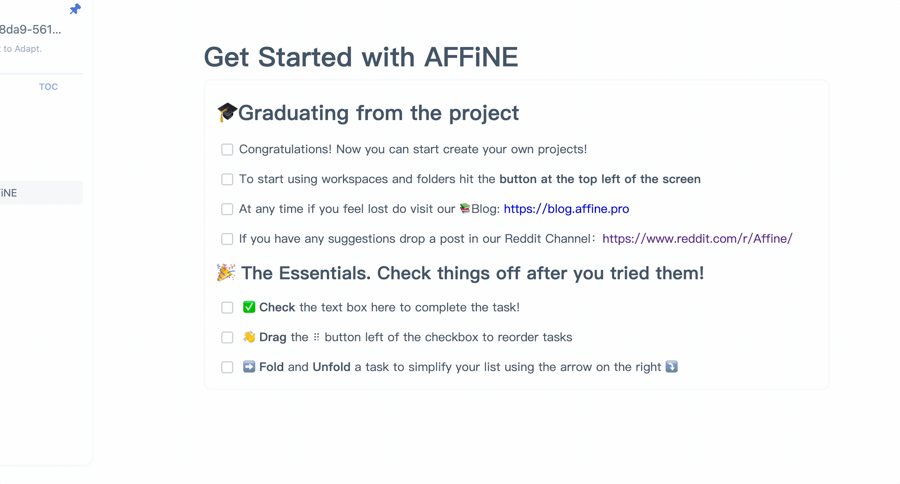

### **Summary**

Please remember that the project is still under active development, so please do not store any important information or data. And we look forward to sharing more information in regards to our future development and roadmap next week. We welcome everyone who tries AFFiNE to get in touch with us. Whether you want to feedback on what your like, or don’t, whether you want to help out with improving the project or offer suggestions… let us know. From GitHub and pull requests, to DMing us on Twitter - we welcome you to be an active part of our community. Let’s build something special - together.

Hope you have a nice time with AFFiNE!
