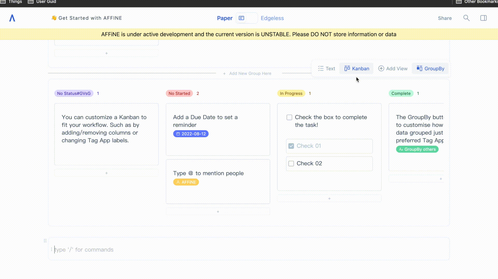

If you’re into productivity tools it’s likely that you have heard and even tried Notion. Often touted as an all-in-one workspace it is a very popular tool with can be both simple, yet powerful. So, if we already have apps like Notion why do we need AFFiNE and what can AFFiNE offer or do, that these other apps can’t?

### **1）Free and open-source**

AFFiNE is free, just like Notion, but it is also open source. What does this mean? Well it means the source code of AFFiNE can be found online and anyone is free to look at it, make their own version of the app, and suggest changes and improvements to be made. So AFFiNE can be seen as an evolving product – a product that will continue to grow and improve as people contribute and make suggestions – in addition to the support and changes provided by the main development team.

And unlike Notion’s paid plans, AFFiNE looks to offer additional features – rather than looking to limit the free and open-source version. As the AFFiNE app is local-first, there is no central server – so some additional features become technically difficult to implement. So AFFiNE’s paid plans look to add additional functionality through AFFiNE Cloud. If you want to learn more about what features are available and when they are planned for release, do check out our roadmap.

### **2）An all-in-one tool**

Well, it’s hard to argue about the versality of Notion – from spreadsheets to notetaking lots of people have come with innovative ways to utilize the app. So how can AFFiNE improve upon this? Well, firstly AFFiNE looks to do things out-of-the-box. What does this mean? Well, if you search fore Notion you’ll find there are many additional services that can be used on Notion (and these are often paid) that add features and functions to Notion. However, AFFiNE looks to offer you the maximum functionality out-of-the-box, without the need for additional third-party services.

### **3）Local-first, privacy focussed**

We mentioned AFFiNE was local-first, but what exactly does this mean? Well, privacy is becoming something more and more people are demanding. Facebook knows everything about you, Amazon knows what you buy and what you want to buy (sometimes even before you do) and Google always seems to know what ads to display to you. People want their privacy back, and that starts with control of your data. You’ll realize when you try our live demo – it’s as simple as that – you open the app and get started. No need to login, create and account or anything else. And your data? Well, that’s stored conveniently on your own computer, not in the clouds of cyberspace. Which leads nicely into our next point. If you lose access to the internet or your current productivity app goes down, can you still work offline?

### **4）Offline and online**

What happens when you go offline or Notion experiences some technical difficulties? Can you still access and edit your work? With AFFiNE you can work offline. Your data is stored local-first, so you don’t need to worry about having an internet connection to access your data – it’s your data, stored where you want it. This also means you can easily backup and copy your data to wherever you need it.

So, what happens when you come back online? Conflict free merging, that’s what. Your changes will be synced and merged with others, even if they have edited and changed the data themselves.

### **5）Databases – store your data once**

Have you used linked databases in Notion? It’s a nice feature right – it gives you more control over your data and allows you to visualize it in more custom ways. But with AFFiNE we try to take this concept one step further. Everything – all your content – everything is a block that can be used as a database. What do we mean? Let’s give you an example.

Let’s say you write a to-do list. Great you’ve got your list, but now you want to show this in another view – how can we do that? Well with AFFiNE we can automagically transform your list into something else, like a Kanban. By utilizing the tag-app, you can add tags such as “in-progress”, “done”, “not-started” – this is just an example and you can add your own tags and customize as you wish. How about if you want a Gantt chart? Sure, let’s add some date tags to indicated the expected items start and finish times.

And let’s not stop there. If you edit any items/data while in any of these modes – the underlying data changes. So, if I drag a “not-started” task into the “in-progress” column while in the Kanban view, if I switch back to the to-do list, the tag of this item will have also changed to “in-progress”. You can truly store your data once and visualize it, and edit it, in any mode you wish.

I had originally planned to go with 10 points, but as I see the length of this article – maybe we can split this into 2 parts. So, if you found this interesting, look out for another article in the future. Hopefully this has got you interested in AFFiNE and what this product will become.

You're welcome to head over to our website and try it out for yourself in our demo, or deploy your own version. We invite you to offer any feedback you may have on this feature, or the product in general. We are always looking to improve so any further questions or suggestions you have are all welcome.

Here are some useful links to learn more about AFFiNE or join our communities. Looking forward to seeing you over on:

Reddit: [https://www.reddit.com/r/Affine/](https://www.reddit.com/r/Affine/)

Discord: [https://discord.gg/Arn7TqJBvG](https://discord.gg/Arn7TqJBvG)

Telegram: [https://t.me/affineworkos](https://t.me/affineworkos)

Twitter: [https://twitter.com/AffineOfficial](https://twitter.com/AffineOfficial)

Medium：[https://medium.com/@affineworkos](https://medium.com/@affineworkos)
