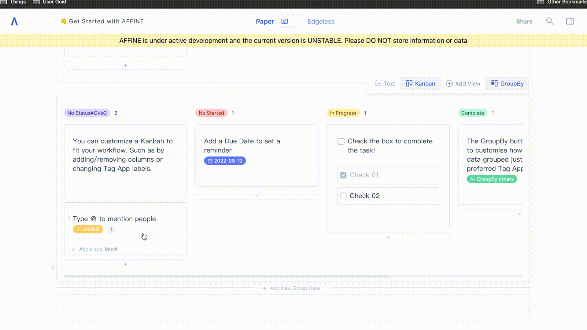
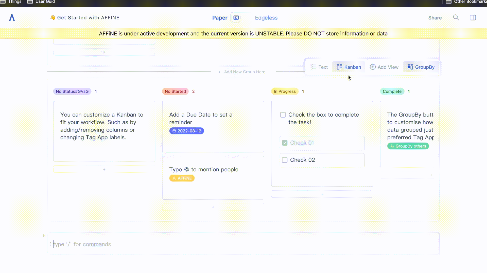
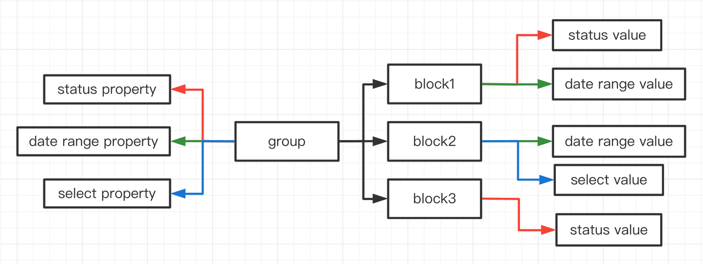
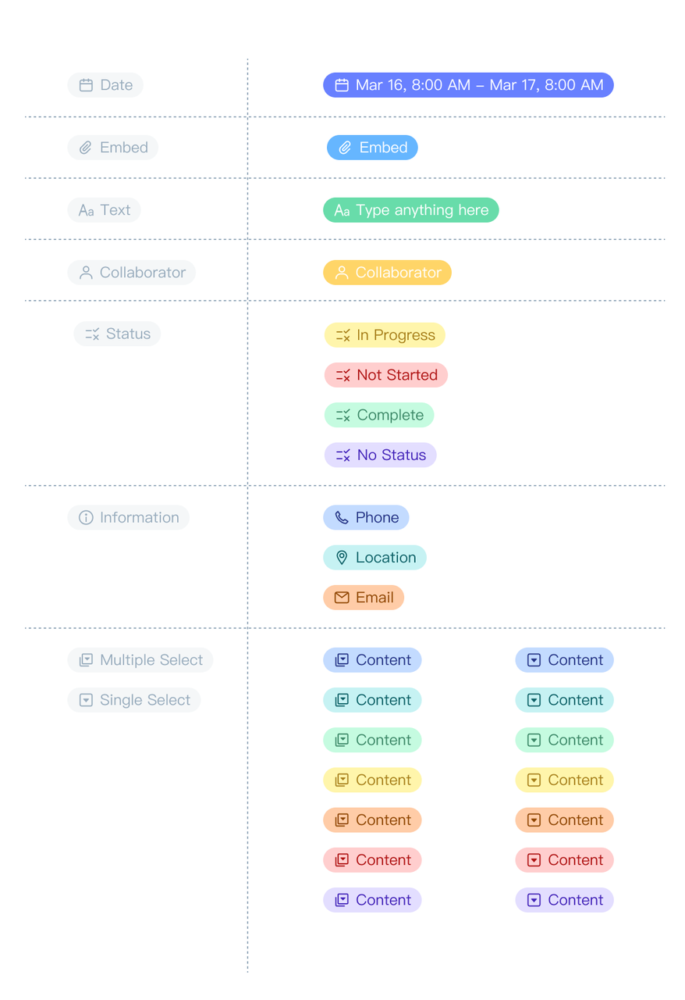
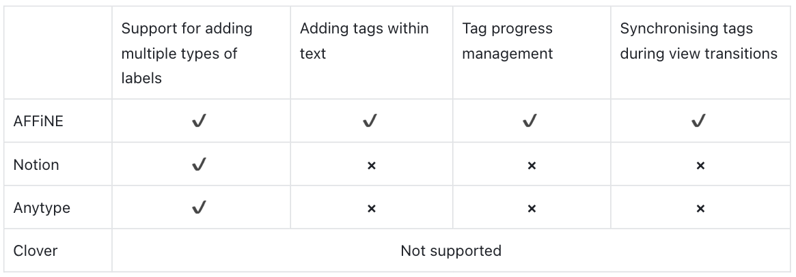

Tags are a useful way to get an idea quickly of what a text is trying to say and its context. When reading an article, it is also possible to use tags to determine in advance whether it is what we are looking for. In modern note taking & check list apps, tags are greatly extended. These "#tags" can be tags, attached files, locations, time stamps, timers, images, or links. Tags can save us time and make our work more efficient.Tags are usually found in task management tools and are used to label lists of tasks. For example, who the task is assigned to, which department it belongs to, etc. For AFFiNE, we hope to use tags to help us mark up the structure of articles, or to synchronise them with text state transitions, so that tags can be extended more flexibly to help our users collaborate better.

## **Key Features：**

### **1\. Progress & Status Management**

The labelling system not only provides basic labelling functionality for each block, but also helps with progress status management. AFFiNE supports a seamless transition between kanban and text views, so that tasks under 'not started' and 'in process' in the kanban board are converted to text and the corresponding text is added with a label like 'no started'. The status of these labels is also updated as the Kanban board is updated.

### **2\. One-ClickTransition**

AFFiNE supports seamless switching between text view and kanban view. We support the creation of multiple group blocks in paper mode, and all blocks can support conversion between the text and Kanban views. Any data changes made to either view will be available and saved for use when switching back. Allowing you to store data in one place, while making different changes in various views/modes. Automatic synchronisation.

## **Key Technology：**

In the tag-app, the data for attributes and values are stored in a separated form, with attributes being stored in groups and values in blocks. With this type of storage, groups can easily transform not only the blocks under them into kanban schemas (status), but also blocks into Gant charts (in the near future) and many more schemas.

## **Key Design：**

**Colour matching of tags system**：AFFiNE classifies these functions from a functional point of view, thus determining the effect of the icon and the colours. It is hoped that visually the different functional labels can be distinguished, making it easier for users to identify them and giving them a lot of scope for customization.

### Differences from other competing products：

We hope this gives you a better understanding of what the tag-app is, some possible use cases and what extra functionality it supports over similar existing systems.

You're welcome to head over to our website and try it out for yourself in our demo, or deploy your own version. We invite you to offer any feedback you may have on this feature, or the product in general. We are always looking to improve so any further questions or suggestions you have are all welcome.

Here are some useful links to learn more about AFFiNE or join our communities. Looking forward to seeing you over on:

- Reddit: [https://www.reddit.com/r/Affine/](https://www.reddit.com/r/Affine/)
- Discord: [https://discord.gg/Arn7TqJBvG](https://discord.gg/Arn7TqJBvG)
- Telegram: [https://t.me/affineworkos](https://t.me/affineworkos)
- Twitter: [https://twitter.com/AffineOfficial](https://twitter.com/AffineOfficial)
- Medium：[https://medium.com/@affineworkos](https://medium.com/@affineworkos)
