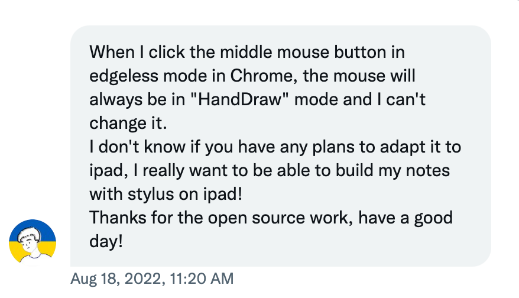
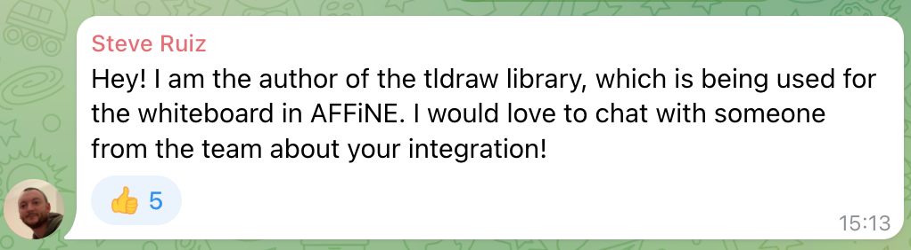
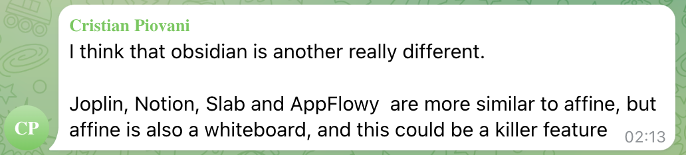
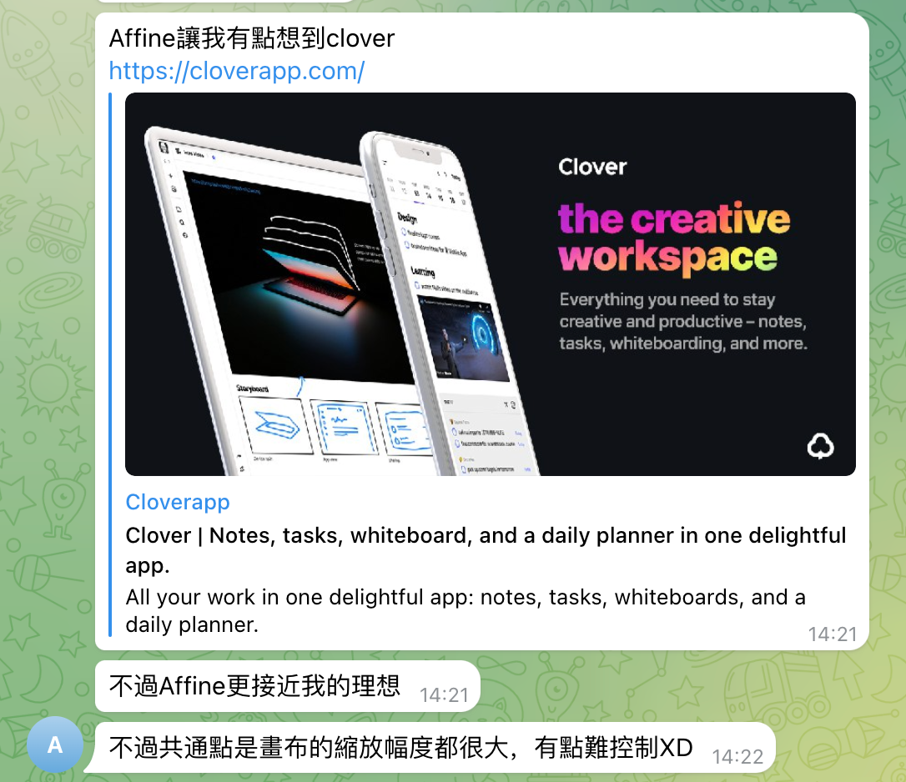
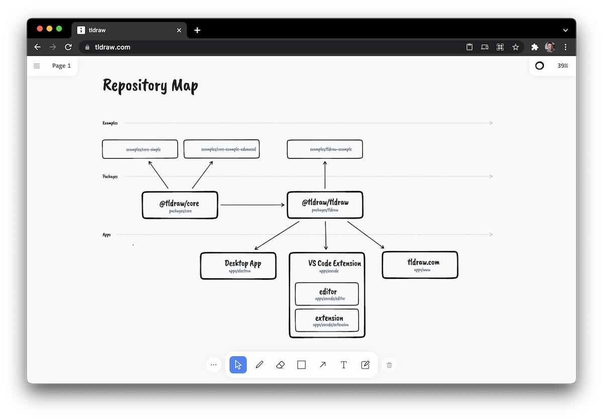
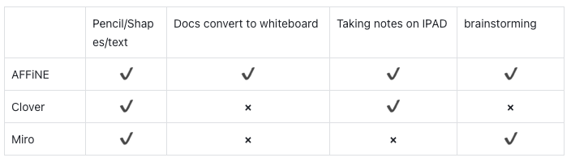

**Introduction:**

Most productivity tools prefer to focus on a single thing, for example, developing a more feature-rich editor or refining whiteboard functionality. But these usually have an Achilles heel; everything you do here has to be based inside the editor or the whiteboard. This means that the efficiency and rich typography of editing in an editor can be limited on the whiteboard. AFFiNE proposes overcoming the barrier between editors and whiteboards through one-click mode switching, which has also become our whiteboard's most significant feature point. Through this article, we would like to introduce you to AFFiNE's whiteboard, which we call Edgeless Mode.

**The live demo released so far has already had some feedback from users about their experience with the whiteboard feature, and here are some of their feelings about using it.**

ID：@\_lyle\_

ID：Steve Ruiz

ID：Christian Piovani

ID: Azure

**The feature introduction**

- Convert docs to Edgeless mode

AFFiNE supports mode conversion to convert doc files to whiteboard. And the data modified by users on the whiteboard can be synchronized after conversion to docs, enabling freer editing and writing.

- Rich toolbar

We added a frame function to the whiteboard for the layout of block groups, support for lines and graphics to add more possibilities for users, a paintbrush function so users can record ideas at will, and support for a laser pointer to help when collaborating in teams.

- Taking notes on IPAD

The iPad and whiteboard mode are a good combination. The iPad can be a much better note-reading tool than a computer or phone because it has the right size and easy portability, making it the preferred note-taking electronic product for many people, and is why we plan to improve support. AFFiNE's support for converting documents into whiteboards provides a solid foundation for this work scenario.

- Online meeting brainstorming

A whiteboard is a good tool for brainstorming, and AFFiNE supports unlimited whiteboards, so you can brainstorm as much as you like. The rich tool support also provides you with better help.

**Technology highlights**

The second development is based on TLDraw, using Zustand to manage state and the same JWST persistence to store data as in the documentation section. The text editing part reuses the documentation code, and a lot of work is done behind the scenes to ensure that the same code works properly on both sides.

**Evaluation**

We will focus on refactoring the design-level whiteboard pattern in the next release. You are also welcome to contact us at any time to provide suggestions on UIUX or product design.

We hope this gives you a better understanding of what the Edgeless (whiteboard) Mode is, some possible use cases, and what extra functionality it supports over similar existing systems. You're welcome to head over to our website and try it out for yourself in our demo, or deploy your own version. We invite you to offer any feedback you may have on this feature, or the product in general. We are always looking to improve, so any further questions or suggestions you have are all welcome.

- Reddit: [https://www.reddit.com/r/Affine/]()
- Discord: [https://discord.gg/Arn7TqJBvG]()
- Telegram: [https://t.me/affineworkos]()
- Twitter: [https://twitter.com/AffineOfficial]()
- Medium：[https://medium.com/@affineworkos](https://medium.com/@affineworkos)
