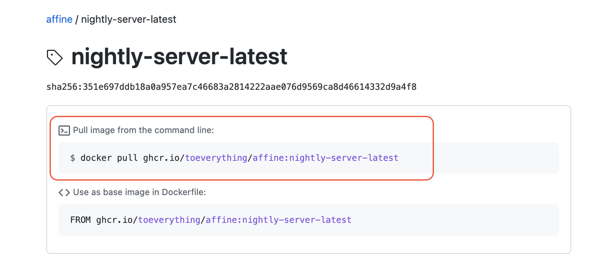
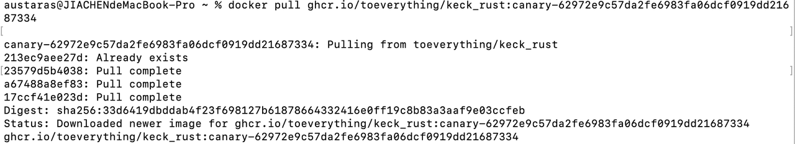
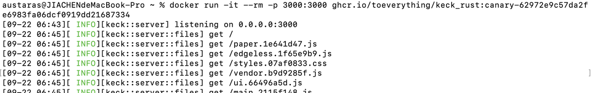
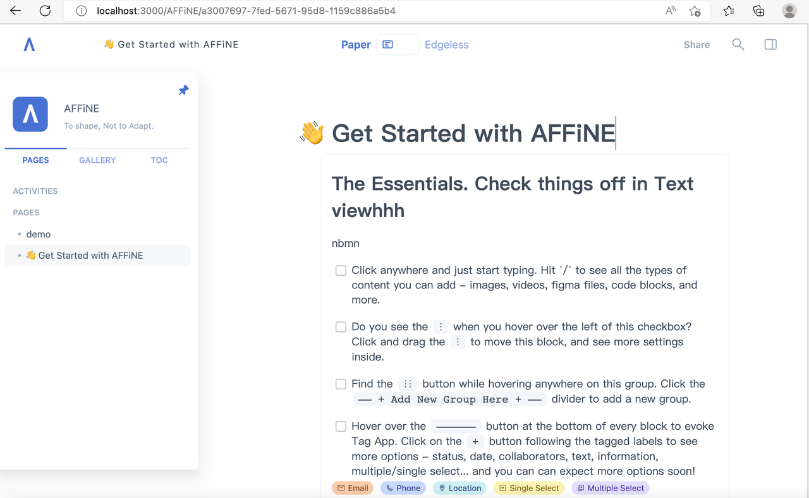

Hello, everybody! The long-awaited release of our **server-side data storage**feature is now here! With the latest version, you can deploy AFFiNE on your own server and your data can be stored on your client locally and on the server-side. This greatly reduces the difficulty of using AFFiNE to store data, and allows users to have more customization options. The GitHub link for AFFiNE is [https://github.com/toeverything/AFFiNE](https://github.com/toeverything/AFFiNE).

So without further or do, let's see how we can deploy the latest version of AFFiNE on your own server.

**Step 1:**You can find the [docker command](https://github.com/toeverything/AFFiNE/pkgs/container/affine/) from our GitHub packages page - the latest release currently uses the tag 'nightly-server-latest. Copy and run this command.

docker pull ghcr.io/toeverything/affine:nightly-server-latest

docker pull

You'll receive a similar message, which indicates that **the latest Docker image** has been downloaded.

download image
**Step 2:**After successfully updating the Docker image, we are now ready to run the docker run command.

docker run -it --rm -p 3000:3000 -v YOUR_PATH:/app/data ghcr.io/toeverything/affine:nightly-server-latest

**Notes**:

The command should take the following format docker run -it --rm -p -v YOUR_PATH:/app/data 3000:3000 \[image id\], where the image id should be the same as in the first step. You can also set \[YOUR_PATH\] to store the data on your host machine, outside of the Docker environment（Remember to replace \[YOUR_PATH\] with the real path on your local device.).

Alternatively, you can directly run the following command:

docker run -it --rm -p 3000:3000 ghcr.io/toeverything/affine:nightly-server-latest

If there are no issues, your AFFiNE deployment should be up and running, you'll receive a similar response as to the image below.

**Step 3:** Head over to your browser and visit _localhost:3000_ (if you are deploying locally, you'll need to enter the IP address if you've deployed it onto a remote server).

localhost address

This update provides you with a brand new Docker container. Docker is a lightweight virtualization platform based on Linux kernel isolation implementation. It allows us to provide you with a unified system environment, which ensures that you'll receive the same smooth feature-rich experience no matter which platform or operating system you deploy on.

With this update, the self-hosted version of the live demo will automatically synchronize data to the server and store it in the /app/data directory in the container.

While not available in this release, we hope in future editions to offer you fully supported offline editing. So when you are editing in AFFiNE and disconnect (working offline, or your connection drops) all your data will still be stored in your browser, no loss of data. And then when the network connection is re-established, AFFiNE will automatically connect to the server and sync the data.

Below we've compiled **some of the most frequently asked questions** regarding our Docker releases.

**Q) Can we use server-side storage?**

A) With this release, you can now take advantage of Docker volumes and store your data on the server-side.

**Q) Where did Sync-to-DIsk go?**

A) This feature proved to be difficult to use. We now use another technology which offers use a more streamlined and user-friendly experience.

**Q) Can I collaborate with others?**

A) Yes, this version now supports live collaboration - though bear in mind the link sharing feature is not implemented.

**Q) Why Docker?**

A) Docker offers a more simplified deployment experience to just get started. And as our code is available on GitHub, you are welcome to deploy from our codebase.

**Q) Is offline editing supported?**

A) No, unfortunately we do not fully support offline editing in this version. In the future, we will use IndexedDB for offline data storage, and envision a seamless offline storage and syncing feature that we hope aim to be making available soon.

\* Due to a bug, the current version only supports offline editing if the user opens AFFiNE while connected to the internet and does not leave/close the page. Once the connection is reestablished, the offline data would then be automatically synchronized to the server.

**Q) Can I use SSL and my own domain?**

A) Yes you can, we don't currently have any step-by-step guide but welcome our community to contribute one.
