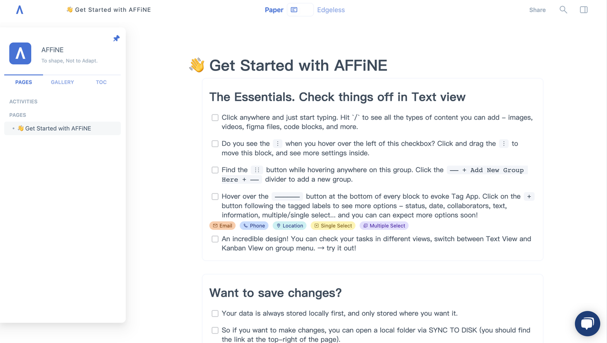
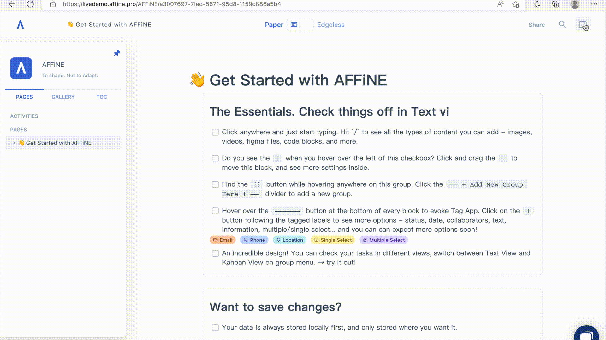
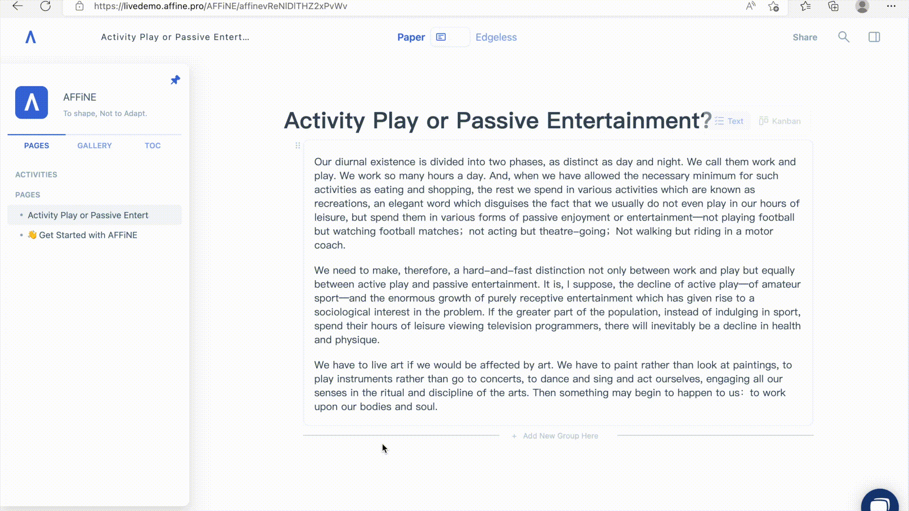
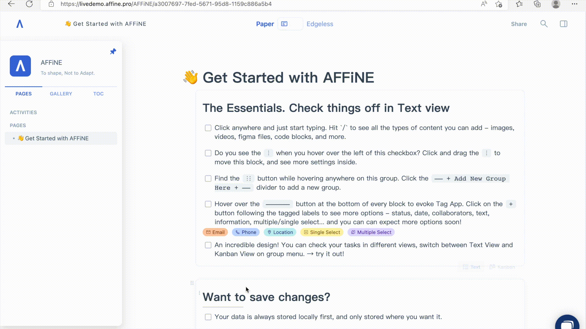
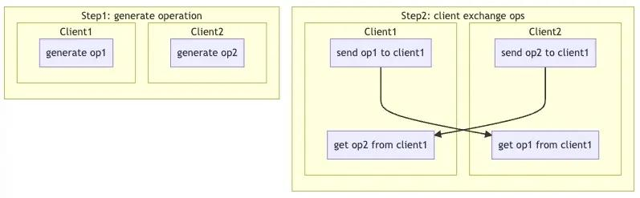

AFFiNE is a local-first personal knowledge base, which means you have full control over your data. In this article we'll help guide you how to use AFFiNE and keep all your data locally stored, and then we'll talk more about the technicals and how we do it.

## 0x01 Keep your data local

AFFiNE provides an out-of-the-box live demo that allows you to use AFFiNE without any downloads, installing or compiling. And you'll still be able to keep your data local.

AFFiNE provides users with rich editing features. When you enter AFFiNE, you can begin creating, editing and managing your data. The toolbar on the left side of AFFiNE helps you to manage your workspace, where you can see all your pages.

Once you've created your content, AFFiNE allows for you to localize and manage your data how you like. Click the icon in the upper right corner to bring up the toolbar and use Export Workspace to save the data locally.

So how about the data in the browser? Don't worry, we also provide users with a one-click clean cache function to ensure that user data is safe and not recorded. You can clear your personal data by selecting the Clear Workspace function in Settings.

When the next time the user uses AFFiNE to edit, simply use the Import Workspace function to import your data.

## 0x02 How we make AFFiNE local first

### 1\. Why other products need to be used online

A lot of personal knowledge base software claims that online services can provide a better experience than local services. Sometimes that comes down to technical limitations. But we at AFFiNE want to do things differently - without compromise.

When you wish to allow remote access to a document, one of the easiest ways to do this is by uploading the file. Then, the server marks a version for the file, and when you update the file, the version updates too when the new file is uploaded.

However, what if we need to make changes to only a part of the file? Do we need to upload the whole file again and again? There are alternatives and the way we approach collaboration is with a series of algorithms collectively called Operational Transformation. This process calls each of your edits an operation, collects them, and executes them one by one on a remote server, and returns the result after execution.

But no matter how it is optimized, the core logic of OT is to establish causality for operations, so that they can operate on a piece of data in a fixed order. This means it is often necessary for them to have a central server, and all clients participating in the collaboration record their operations, submit them to a central server to perform the operation, and then wait for the results to be feedback. So, how can we do this without a central server?

### 2\. How do we solve this problem

We want to make a local-first application, which means we want users to be able to edit offline, on multiple clients and be able to seamlessly submit changes when going back online. We consulted many papers and tested many libraries, and finally chose Yjs, which is based on YATA CRDT\[1\].

CRDT stands for Conflict-free replicated data type. It aims to build an algorithm that allows two sets of data to be merged together without conflict. YATA is one type of CRDT, and Yjs is the implementation of that YATA algorithm.

Why does CRDT allow two pieces of data to be merged without conflict? Maybe the simplest way we can explain this is as follows. We can design two copies of data to be commutative, eg: op1 + op2 = op2 + op1, which means if we make 2 edits (or operations) to the same document on 2 different clients, as long as both parties can hand over their operations to the other, they can get the same final result regardless of who generated the operation first.

exchange operation without server

We applied Yjs as the data storage layer at the bottom, and built a new library based on it, we call it JWT\[2\], which will provide Block abstraction to the upper layer, and provide post-processing capabilities such as full-text search and data analysis. This means that the upper layer (in AFFiNE, the upper layers are our block editor Virgo and our vector editor Phasor) only needs to understand that what it is operating on is a block.

### 3\. Your data is always yours

Based on the powerful capabilities of the CRDT algorithm, the excellent optimization of Yjs, and the abstraction of JWT\[2\]'s ability to block, we are able to provide a set of local-first data layer infrastructure, which enables AFFiNE to provide powerful offline collaborative editing capabilities and local editing experience.

Currently, all editing of AFFiNE is based on JWT\[2\], and data processing does not require a server. Therefore, whether you use AFFiNE in our Live Demo, a locally built Docker container or a self-hosted server, all the data you generate is saved to your local hard disk through the SYNC TO DISK feature, and your data is always yours.

\[1\] [Near Real-Time Peer-to-Peer Shared Editing on Extensible Data Types](https://www.researchgate.net/publication/310212186_Near_Real-Time_Peer-to-Peer_Shared_Editing_on_Extensible_Data_Types)

\[2\] Our current version of the data backend is written in TypeScript and called JWT, and the next generation data backend is written in Rust and called JWST, both codenames inspired by [James Webb Space Telescope](https://en.wikipedia.org/wiki/James_Webb_Space_Telescope)

We welcome every user to offer feedback and suggestions. Please feel free to contact us on:

- Reddit: [https://www.reddit.com/r/Affine/](https://www.reddit.com/r/Affine/)
- Discord: [https://discord.gg/Arn7TqJBvG](https://discord.gg/Arn7TqJBvG)
- Telegram: [https://t.me/affineworkos](https://t.me/affineworkos)
- Twitter: [https://twitter.com/AffineOfficial](https://twitter.com/AffineOfficial)
- Medium: [https://medium.com/@affineworkos](https://medium.com/@affineworkos)
- GitHub: [https://github.com/toeverything/AFFiNE](https://github.com/toeverything/AFFiNE)
- Official Website: [https://affine.pro/](https://affine.pro/)
- Feedback: [https://feedback.affine.pro/boards/feature-requests](https://feedback.affine.pro/boards/feature-requests)
