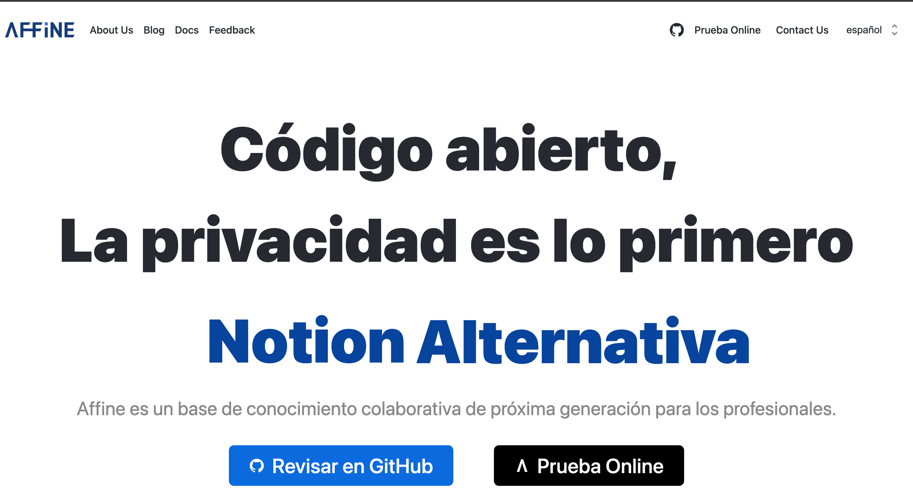
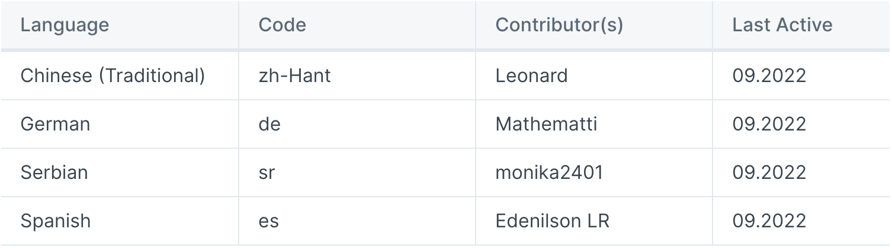
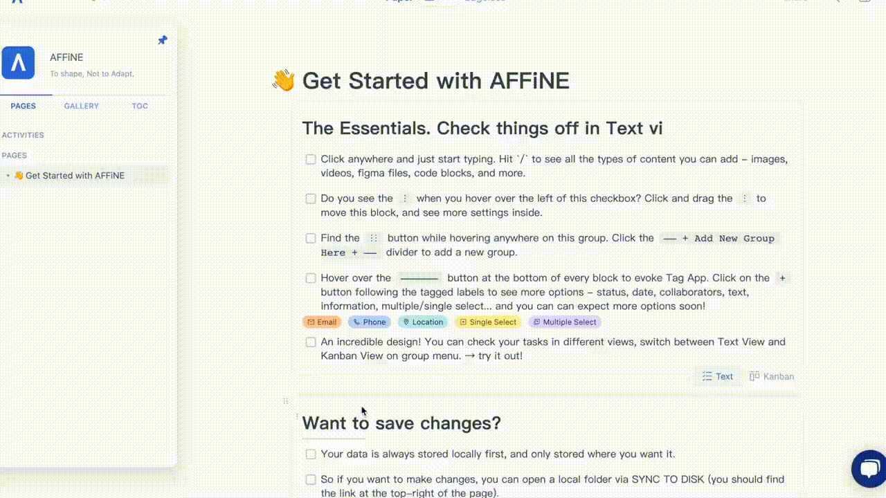
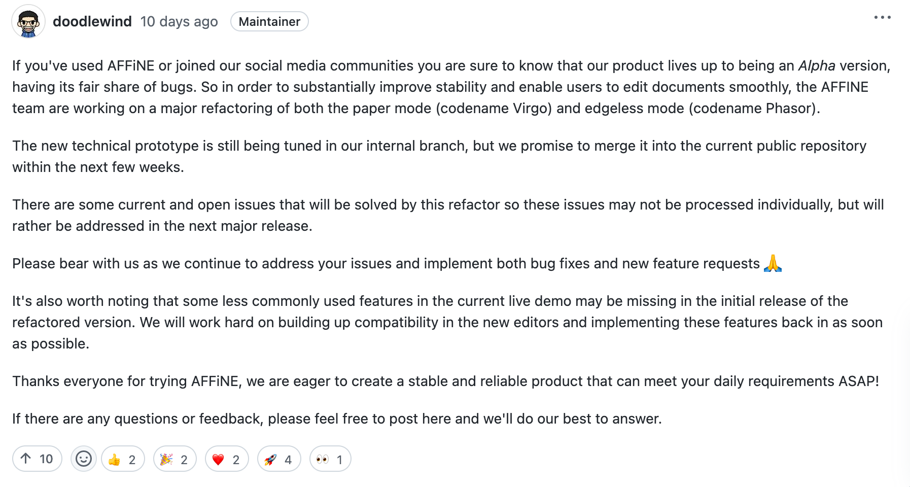
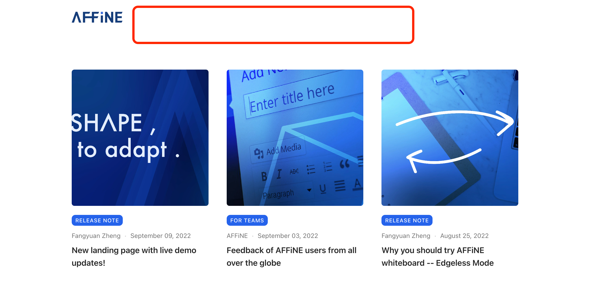
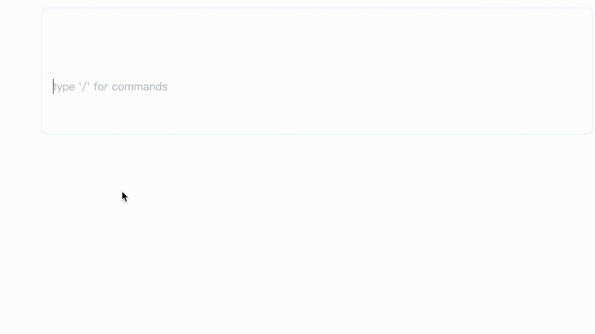
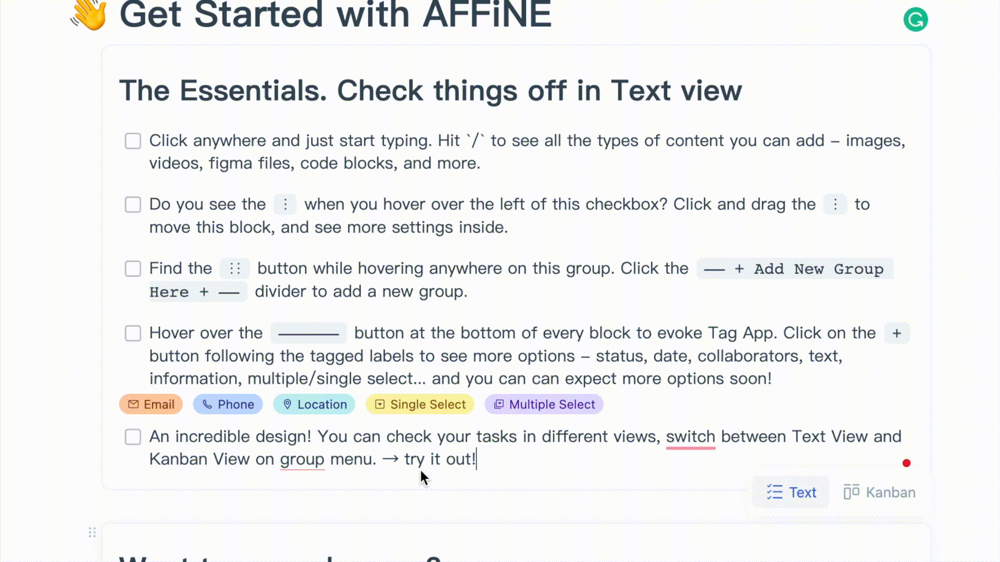

**Thank you very much for your interest in AFFiNE! Some exciting changes are as follows:**

#### Major news:

**1\. Our official website is now in Spanish!**

Thanks to Leonard, Mathematti, monika2401 and Edenilson LR, we have added our translation contributor list on Gitbook: [https://docs.affine.pro/affine/internationalization/contributors](https://docs.affine.pro/affine/internationalization/contributors)

**2\. Live chat support has been added to the live demo.**

**3\. AFFiNE is undergoing a major refactor, any discussion about it would be always welcomed:**[https://github.com/toeverything/AFFiNE/discussions/380](https://github.com/toeverything/AFFiNE/discussions/380)

**4\. Our blog will be upgraded to a new system**

The blog page previously had three category buttons at the top, but they didn't respond when clicked. Now we have taken this part of the navigation bar offline to wait for subsequent optimization before going online. We are preparing a new blog site that can be updated via Github and hope to release it before the end of next week.

#### **Bug Fixes**

- Fixed: Enter the keyword '/' to search, then enter will keep the search term.
- Fixed: Improve command+A user experience
- Fixed: When the keyboard controls the cursor movement down and up, the cursor can switch to CodeBlock smoothly
- Fixed: After the code block is created successfully, the cursor is automatically focused

- Fixed: In paper mode, both Blocks & Block Groups can be selected by Ctrl+A and can be deleted by pressing Delete directly after selection.

- Fixed: Improve the logic of the operation: after pressing enter, whether to change the line or create a new block, each time you press the result is different.

#### Ambassador Progress

Our AFFiNE Ambassadors have been working hard to help improve and promote AFFiNE. From localization, to moderating our social media channels, we are extremely happy to have so many dedicated and enthusiastic community members.

In particular, we are working on improving the resources available to our ambassadors and are continually looking at how we can further support and help our ambassadors grow. Whether you want to grow yourself on social media or would like to help contribute to our codebase, we welcome all types of users from all over the world.

Let us know your interests, what you would like to do, and how we can help support you. You can learn more about the program, and how to apply over on our official over at [AFFiNE Docs - AFFiNE Ambassadors](https://docs.affine.pro/affine/affine-ambassadors/welcome).

AFFiNE is still in alpha, but we are continuing to build to a more feature-rich and stable build. Come and join us on our journey over on our media platforms.

- Reddit: [https://www.reddit.com/r/Affine/](https://www.reddit.com/r/Affine/)
- Discord: [https://discord.gg/Arn7TqJBvG](https://discord.gg/Arn7TqJBvG)
- Telegram: [https://t.me/affineworkos](https://t.me/affineworkos)
- Twitter: [https://twitter.com/AffineOfficial](https://twitter.com/AffineOfficial)
- Medium: [https://medium.com/@affineworkos](https://medium.com/@affineworkos)
- GitHub: [https://github.com/toeverything/AFFiNE]()
- Official Website: [https://affine.pro/](https://affine.pro/)
- Feedback: [https://feedback.affine.pro/boards/feature-requests]()

We hope to release a more stable version in October, and we always welcome any advice/feedback about us!
